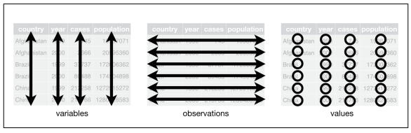

--- 
title: "Statistika Lingkungan Menggunakan R"
author: "Moh. Rosidi"
date: "2019-03-20"
site: bookdown::bookdown_site
documentclass: book
bibliography: [book.bib, packages.bib]
biblio-style: apalike
link-citations: yes
description: "This is a minimal example of using the bookdown package to write a book. The output format for this example is bookdown::gitbook."
---

# Pengantar {-}

Buku ini menyajikan penerapan program `R` dalam `Statistika Lingkungan`. Buku ini akan disajikan secara ringkas menggunakan sejumlah contoh kasus yang relevan dalam bidang lingkungan.

Penulis berharap buku ini dapat menjadi referensi sumber terbuka bagi mahasiswa yang ingin menggunakan `R` untuk kegiatan analisa data. Sehingga dapat mengurangi ketergantungan pada penggunaan aplikasi yang berlisensi.


<!--chapter:end:index.Rmd-->

# Mengenal Bahasa R 

## Sejarah R

`R` Merupakan bahasa yang digunakan dalam komputasi **statistik** yang pertama kali dikembangkan oleh **Ross Ihaka** dan **Robert Gentlement** di University of Auckland  New Zealand yang merupakan akronim dari nama depan kedua pembuatnya. Sebelum `R` dikenal ada `S` yang dikembangkan oleh **John Chambers** dan rekan-rekan dari **Bell Laboratories** yang memiliki fungsi yang sama untuk komputasi statistik. Hal yang membedakan antara keduanya adalah `R` merupakan sistem komputasi yang bersifat gratis.Logo `R` dapat dilihat pada Figure \@ref(fig:Logo).

<div class="figure" style="text-align: center">

<p class="caption">(\#fig:Logo)Logo R.</p>
</div>

`R` dapat dibilang merupakan aplikasi sistem **statistik** yang kaya. Hal ini disebabkan banyak sekali paket yang dikembangkan oleh pengembang dan komunitas untuk keperluan analisa statistik seperti *linear regression*, *clustering*, *statistical test*, dll. Selain itu, `R` juga dapat ditambahkan paket-paket lain yang dapat meningkatkan fiturnya.

Sebagai sebuah bahasa pemrograman yang banyak digunakan untuk keperluan analisa data, `R` dapat dioperasikan pada berbagai sistem operasi pada komputer. Adapun sistem operasi yang didukung antara lain: `UNIX`, `Linux`, `Windows`, dan `MacOS`.


## Fitur dan Karakteristik R

`R` memiliki karakteristik yang berbeda dengan bahasa pemrograman lain seperti `C++`,`python`, dll. `R` memiliki aturan/sintaks yang berbeda dengan bahasa pemrograman yang lain yang membuatnya memiliki ciri khas tersendiri dibanding bahasa pemrograman yang lain.

Beberapa ciri dan fitur pada `R` antara lain:

1. **Bahasa `R` bersifat case sensitif**. maksudnya adalah dalam proses input `R` huruf besar dan kecil sangat diperhatikan. Sebagai contoh kita ingin melihat apakah objek A dan B pada sintaks berikut:

```r
A <- "Andi"
B <- "andi"

# cek kedua objek A dan B
A == B
```

```
## [1] FALSE
```

```r
# Kesimpulan : Kedua objek berbeda
```
2. **Segala sesuatu yang ada pada program `R` akan diangap sebagai objek**. konsep objek ini sama dengan bahasa pemrograma berbasis objek yang lain seperti `Java`, `C++`, `python`, dll.Perbedaannya adalah bahasa `R` relatif lebih sederhana dibandingkan bahasa pemrograman berbasis obejk yang lain.
3. **interpreted language atau script**. Bahasa `R` memungkinkan pengguna untuk melakukan kerja pada `R` tanpa perlu kompilasi kode program menjadi bahasa mesin.
4. Mendukung proses **loop**, **decision making**, dan menyediakan berbagai jenis **operstor** (aritmatika, logika, dll).
5. **Mendukung export dan import berbagai format file**, seperti:TXT, CSV, XLS, dll.
6. **Mudah ditingkatkan melalui penambahan fungsi atau paket**. Penambahan paket dapat dilakukan secara online melalui [CRAN](https://cran.r-project.org/) atau melalui sumber seperti [github](https://github.com/).
7. **Menyedikan berbagai fungsi untuk keperluan visualisasi data**. Visualisasi data pada `R` dapat menggunakan paket bawaan atau paket lain seperti `ggplo2`,`ggvis`, dll.

##  Kelebihan dan Kekurangan R

Selain karena `R` dapat digunakan secara gratis terdapat **kelebihan** lain yang ditawarkan, antara lain:

1. **Protability**. Penggunaan software dapat digunakan kapanpun tanpa terikat oleh masa berakhirnya lisensi.
2. **Multiplatform**. `R` bersifat *Multiplatform Operating Systems*, dimana *software* `R` lebih kompatibel dibanding *software* statistika lainnya. Hal in berdampak pada kemudahan dalam penyesuaian jika pengguna harus berpindah sistem operasi karena `R` baik pada sistem operasi seperti `windows` akan sama pengoperasiannya dengan yang ada di `Linux` (paket yang digunakan sama).
3. **General** dan **Cutting-edge**. Berbagai metode statistik baik metode klasik maupun baru telah diprogram kedalam `R`. Dengan demikian *software* ini dapat digunakan untuk analisis statistika dengan pendekatan klasik dan pendekatan modern.
4. **Programable**. Pengguna dapat memprogram metode baru atau mengembangakan modifikasi dari analisis statistika yang telah ada pada sistem `R`.
5. **Berbasis analisis matriks**. Bahasa `R` sangat baik digunakan untuk *programming* dengan basis matriks.
6. Fasiltas grafik yang lengkap.

Adapun kekurangan dari `R` antara lain:

1. **Point and Click GUI**. Interaksi utama dengan `R` bersifat *CLI* (*Command Line Interface*), walaupun saat ini telah dikembangkan paket yang memungkinkan kita berinteraksi dengan `R` menggunakan *GUI* (*Graphical User Interface*) sederhana menggunakan paket `R-Commander` yang memiliki fungsi yang terbatas. `R- Commander` sendiri merupakan *GUI* yang diciptakan dengan tujuan untuk keperluan pengajaran sehingga analisis statistik yang disediakan adalah yang klasik. Meskipun terbatas paket ini berguna jika kita membutuhkan analisis statistik sederhana dengan cara yang simpel.
2. **Missing statistical function**. Meskipun analisis statistika dalam `R` sudah cukup lengkap, namun tidak semua metode statistika telah diimplementasikan ke dalam `R`. Namun karena `R` merupakan *lingua franca* untuk keperluan komputasi statistika modern staan ini, dapat dikatakan ketersediaan fungsi tambahan dalam bentuk paket hanya masalah waktu saja.


##  RStudio

Aplikasi `R` pada dasarnya berbasis teks atau *command line* sehingga pengguna harus mengetikkan perintah-perintah tertentu dan harus hapal perintah-perintahnya. Setidaknya jika kita ingin melakukan kegiatan analisa data menggunakan `R` kita harus selalu siap dengan perintah-perintah yang hendak digunakan sehingga buku manual menjadi sesuatu yang wajib adasaat berkeja dengan `R`.

Kondisi ini sering kali membingunkan bagi pengguna pemula maupun pengguna mahir yang sudah terbiasa dengan aplikasi statistik lain seperti SAS, SPSS, Minitab, dll. Alasan itulah yang menyebabkan pengembang `R` membuat berbagai *frontend* untuk `R` yang berguna untuk memudahkan dalam pengoperasian `R`. 

`RStudio` merupakan salah satu bentuk *frontend* `R` yang cukup populer dan nyaman digunakan. Selain nyaman digunakan, `RStudio`  memungkinkan kita melakukan penulisan laporan menggunakan `Rmarkdown` atau `RNotebook` serta membuat berbagai bentuk project seperti shyni, dll. Pada `R` studio juga memungkinkan kita mengatur *working directory* tanpa perlu mengetikkan sintaks pada Commander, yang diperlukan hanya memilihnya di menu `RStudio`. Selain itu, kita juga dapat meng-import file berisikan data tanpa perlu mengetikkan pada Commander  dengan cara memilih pada menu `Environment`.

##  Menginstall R dan RStudio

Pada tutorial ini hanya akan dijelaskan bagaimana menginstal `R` dan `RStudio` pada sistem operasi `windows`. Sebelum memulai menginstal sebaiknya pembaca mengunduh terlebih dahulu *installer* [R](https://cran.r-project.org/bin/windows/base/) dan [RStudio](https://www.rstudio.com/products/rstudio/download/).

1. Jalankan proses pemasangan dengan meng-klik *installer* aplikasi `R` dan `RStudio`.
2. Ikuti langkah proses pemasangan aplikasi yang ditampilkan dengan klik `OK` atau `Next`.
3. Apabila pemasangan telah dilakukan, jalankan aplikasi yang telah terpasang untuk menguji jika aplikasi telah berjalan dengan baik.

Jendela aplikasi yang telah terpasang ditampilkan pada Figure \@ref(fig:jendela-R) dan Figure \@ref(fig:jendela-RStudio).

<div class="figure" style="text-align: center">

<p class="caption">(\#fig:jendela-R)Jendela R.</p>
</div>

<div class="figure" style="text-align: center">

<p class="caption">(\#fig:jendela-RStudio)Jendela RStudio.</p>
</div>


> **Note: ** Sebaiknya install `R` terlebih dahulu sebelum `RStudio`

##  Working Directory

Setiap pengguna akan bekerja pada tempat khusus yang disebut sebagai *working directory*. *working directory* merupakan sebuah folder dimana `R` akan membaca dan menyimpan file kerja kita. Pada pengguna `windows`, *working directory* secara default pada saat pertama kali menginstall `R` terletak pada folder `c:\\Document`.

### Mengubah Lokasi Working Directory

Kita dapat mengubah lokasi *working directory* berdasarkan lokasi yang kita inginkan, misalnya letak data yang akan kita olah tidak ada pada folder default atau kita ingin pekerjaan kita terkait `R` dapat berlangsung pada satu folder khusus.

Berikut adalah cara mengubah *working directory* pada `R`.

1. Buatlah folder pada drive (kita bisa membuat folder pada selain drive c) dan namai dengan nama yang kalian inginkan. Pada tutorial ini penulis menggunakan nama folder `R`.
2. Jika pengguna menggunakan `RStudio`, pada menu `RStudio` pilih **Session > Set Working Directory > Chooses Directory**. Proses tersebut ditampilkan pada Figure \@ref(fig:working)
3. Pilih folder yang telah dibuat pada step 1 sebagai *working directory.

> **Note: ** Data atau file yang hendak dibaca selama proses kerja pada `R` harus selalu diletakkan pada working directory. Jika tidak maka data atau file tidak akan terbaca.

Untuk mengecek apakah proses perubahan telah terjadi, kita dapat mengeceknya dengan menjalankan perintah berikut untuk melihat lokasi *working directory* kita yang baru.


```r
getwd()
```

<div class="figure" style="text-align: center">

<p class="caption">(\#fig:working)Mengubah working directory.</p>
</div>

Selain itu kita dapat mengubah *working directory* menggunakan perintah berikut:


```r
# Ubah working directori pada folder R
setwd("/Documents/R")
```

> **Note: ** Pada proses pengisian lokasi folder pastikan pemisah pada lokasi folder menggunakan tanda "/" bukan "\"

### Mengubah Lokasi Working Directory Default

Pada proses yang telah penulis jelaskan sebelumnya. Proses perubahan *working directory* hanya berlaku pada saat pekerjaan tersebut dilakukan. Setelah pekerjaan selesai dan kita menjalankan kembali `R` maka *working directory* akan kembali secara default pada working directory lama.

Untuk membuat lokasi default *working directory* pindah, kita dapat melakukannya dengan memilih pada menu: **Tools > Global options > pada "General" klik pada "Browse" dan pilih lokasi working directory yang diinginkan**. Proses tersebut ditampilkan pada Figure \@ref(fig:default)

<div class="figure" style="text-align: center">

<p class="caption">(\#fig:default)Merubah working directory melalui Global options.</p>
</div>

## Fasilitas Help

Agar dapat menggunakan `R` dengan secara lebih baik, pengetahuan untuk mengakses fasilitas *help* in cukup penting untuk disampaikan. Adapun cara yang dapat digunakan adalah sebagai berikut.

### Mencari Help dari Suatu Perintah Tertentu

Untuk memperoleh bantuan terkait suatu perintah tertentu kita dapat menggunakan fungsi `help()`. Secara umum format yang digunakan adalah sebagai berikut:


```r
help(nama_perintah)
```

atau dapat juga menggunakan tanda tanya (?) pada awal `nama_perintah` seperti berikut:


```r
?nama_perintah
```

Misalkan kita kebingungan terkait bagaimana cara menuliskan perintah untuk menghitung rata-rata suatu vektor. Kita dapat mengetikkan perintah berikut untuk mengakses fasilitas *help*.


```r
help(mean)

#atau
?mean
```

Perintah tersebut akan memunculkan hasil berupa dokumentasi yang ditampilkan pada Figure \@ref(fig:meandoc).

<div class="figure" style="text-align: center">

<p class="caption">(\#fig:meandoc)Jendela help dokumentasi fungsi mean().</p>
</div>

Keterangan pada jendela pada Figure \@ref(fig:meandoc) adalah sebagia berikut:

1. Pada bagian jendela kiri atas jendela *help*, diberikan keterangan nama dari perintah yang sedang ditampilkan.
2. Selanjutnya, pada bagian atas dokumen, ditampilkan infomasi terkait nama perintah, dan nama *library* yang memuat perintah tersebut. Pada gambar diatas informasi terkait perintah dan nama *library* ditunjukkan pada teks `mean {base}` yang menunjukkan perintah `mean()` pada paket (*library*) *base* (paket bawaan `R`).
3. Setiap jendela *help* dari suatu perintah tertentu selanjutnya akan memuat bagian-bagian berikut:
- *Title*
- *Description* : deskripsi singkat tentang perintah.
- *Usage* : menampilkan sintaks perintah untuk penggunaan perintah tersebut.
- *Arguments* : keterangan mengenai *argument/input*yang diperlukan pada perintah tersebut.
- *Details* : keterangan lebih lengkap lengkap tentang perintah tersebut.
- *Value* : keterangan tentang *output* suatu perintah dapat diperoleh pada bagian ini.
- *Author(s)* : memberikan keterangan tentang *Author* dari perintah tersebut.
- *References* : seringkali referensi yang dapat digunakan untuk memperoleh keterangan lebih lanjut terhadap suatu perintah ditampilkan pada bagian ini.
- *See also*: bagian ini berisikan daftar perintah/fungsi yang berhubungan erat dengan perintah tersebut.
- *Example* : berisikan contoh-contoh penggunaan perintah tersebut.

Kita juga dapat melihat contoh penggunaan dari perintah tersebut. Untuk melakukannya kita dapat menggunakan fungsi `example()`. Fungsi tersebut akan menampilkan contoh kode penerapan dari fungsi yang kita inginkan. Secara sederhana fungsi tersebut dapat dituliskan sebagai berikut:


```r
example(nama_perintah)
```

Untuk mengetahui contoh kode fungsi `mean()`, ketikkan sintaks berikut:


```r
example(mean)
```

```
## 
## mean> x <- c(0:10, 50)
## 
## mean> xm <- mean(x)
## 
## mean> c(xm, mean(x, trim = 0.10))
## [1] 8.75 5.50
```

kita juga dapat mencoba kode yang dihasilkan pada console `R`. Berikut adalah contoh penerapannya:


```r
# Menghitung rata-rata bilangan 1 sampai 10 dan 50
# membuat vektor
x <- c(0:10, 50)

# Print
x
```

```
##  [1]  0  1  2  3  4  5  6  7  8  9 10 50
```

```r
# mean
mean(x)
```

```
## [1] 8.75
```

Pembaca dapat mencoba melakukanya sendiri dengan mengganti nilai yang telah ada serta mencoba contoh kode yang lain.

### General Help

Kita juga dapat membaca beberapa dokumen manual yang ada pada `R`. Untuk melakukannya jalankan perintah berikut:


```r
help.start()
```

Output yang dihasilkan berupa link pada sejumlah dokumen yang dapat kita klik. Tampilan halaman yang dihasilkan disajikan pada Figure \@ref(fig:generalhelp).

<div class="figure" style="text-align: center">

<p class="caption">(\#fig:generalhelp)Jendela general help dokumentasi fungsi mean().</p>
</div>

### Fasilitas Help Lainnya

Selain yang telah penulis sebutkan sebelumnya. Kita juga dapat memanfaatkan fasilitas *help* lainnya melalui fungsi `apropos()` dan `help.search()`.

`apropos ()`: mengembalikan daftar objek, berisi pola yang pembaca cari, dengan pencocokan sebagian. Ini berguna ketika pembaca tidak ingat persis nama fungsi yang akan digunakan. Berikut adalah contoh ketika penulis ingin mengetahui fungsi yang digunakan untuk menghitung median.


```r
apropos("med")
```

```
## [1] "elNamed"        "elNamed<-"      "median"         "median.default"
## [5] "median_hilow"   "medpolish"      "runmed"
```

*List* yang dihasilkan berupa fungsi-fungsi yang memiliki elemen kata "med". Berdasarkan pencaria tersebut penulis dapat mencoba menggunakan fungsi "median" untuk menghitung median.

`help.search ()` (sebagai alternatif ??): mencari dokumentasi yang cocok dengan karakter yang diberikan dengan cara yang berbeda. Ini mengembalikan daftar fungsi yang mengandung istilah yang pembaca cari dengan deskripsi singkat dari fungsi.

Berikut adalah contoh penerapan dari fungsi tersebut:


```r
help.search("mean")

# atau
??mean
```

*Output* yang dihasilkan akan tampak seperti pada Figure \@ref(fig:helpsearch).

<div class="figure" style="text-align: center">

<p class="caption">(\#fig:helpsearch)Jendela help search dokumentasi fungsi mean().</p>
</div>


## Referensi

1. Primartha, R. 2018. **Belajar Machine Learning Teori dan Praktik**. Penerbit Informatika : Bandung
2. Rosadi,D. 2016. **Analisis Statistika dengan R**. Gadjah Mada University Press: Yogyakarta
3. STHDA. Running RStudio and Setting Up Your Working Directory - Easy R Programming .<http://www.sthda.com/english/wiki/running-rstudio-and-setting-up-your-working-directory-easy-r-programming#set-your-working-directory>
4. STDHA. **Getting Help With Functions In R Programming**. <http://www.sthda.com/english/wiki/getting-help-with-functions-in-r-programming> .
5. Venables, W.N. Smith D.M. and R Core Team. 2018. **An Introduction to R**. R Manuals.

<!--chapter:end:01-mengenal-bahasa-r.Rmd-->

# Sintaks Bahasa R

## Operator Aritmatika

Proses perhitungan akan ditangani oleh fungsi khusus. `R` akan memahami urutannya secara benar. Kecuali kita secara eksplisit menetapkan yang lain. Sebagai contoh jalankan sintaks berikut:


```r
2+4*2
```

```
## [1] 10
```

Bandingkan dengan sintaks berikut:


```r
(2+4)*2
```

```
## [1] 12
```

> `R` dapat digunakan sebagai kalkulator

Berdasarkan kedua hasil tersebut dapat disimpulkan bahwa ketika kita tidak menetapkan urutan perhitungan menggunakan tanda kurung, `R` akan secara otomatis akan menghitung terlebih dahulu perkalian atau pembangian. 

Operator aritmatika yang disediakan `R` adalah sebagai berikut:

**Table 1** Operator Aritmatika `R`

**Simbol**     | **Keterangan**
---------------|--------------------------------------------------------------------------------------
+              | *Addition*, untuk operasi penjumlahan
-              | *Substraction*, untuk operasi pengurangan
*              | *Multiplication*, untuk operasi pembagian
/              | *Division*, untuk operasi pembagian
^              | *Eksponentiation*, untuk operasi pemangkatan
%%             | *Modulus*, Untuk mencari sisa pembagian
%/%            | *Integer*, Untuk mencari bilangan bulat hasil pembagian saja dan tanpa sisa pembagian

Untuk lebih memahaminya berikut contoh sintaks penerapan operator tersebut.


```r
# Addition
5+3
```

```
## [1] 8
```

```r
# Substraction
5-3
```

```
## [1] 2
```

```r
# Multiplication
5*3
```

```
## [1] 15
```

```r
# Division
5/3
```

```
## [1] 1.666667
```

```r
# Eksponetiation
5^3
```

```
## [1] 125
```

```r
# Modulus
5%%3
```

```
## [1] 2
```

```r
# Integer
5%/%3
```

```
## [1] 1
```

> *Note: * Pada `R` tanda `#` berfungsi menambahkan keterangan untuk menjelaskan sebuah sintaks pada `R`.

## Fungsi Aritmetik

Selain fungsi operator aritmetik, pada `R` juga telah tersedia fungsi aritmetik yang lain seperti logaritmik, ekponensial, trigonometri, dll.

1. Logaritma dan eksponensial

Untuk contoh fungsi logaritmik dan eksponensial jalankan sintaks berikut:


```r
log2(8) # logaritma basis 2 untuk 8
```

```
## [1] 3
```

```r
log10(8) # logaritma basis 10 untuk 8
```

```
## [1] 0.90309
```

```r
exp(8) # eksponensial 8
```

```
## [1] 2980.958
```

2. Fungsi trigonometri

fungsi trigonometri yang ditampilkan seperti sin,cos, tan, dll.


```r
cos(x) # cos x
sin(x) # Sin x
tan(x) # Tan x
acos(x) # arc-cos x
asin(x) # arc-sin x
atan(x) #arc-tan x
```

> **Note: ** x dalam fungsi trigonometri memiliki satuan radian

Berikut adalah salah satu contoh penggunaannya:


```r
cos(pi)
```

```
## [1] -1
```


3. Fungsi matematik lainnya

Fungsi lainnya yang dapat digunakan adalah fungsi absolut, akar kuadrat, dll. Berikut adalah contoh sintaks penggunaan fungsi absolut dan akar kuadrat.


```r
abs(-2) # nilai absolut -2
```

```
## [1] 2
```

```r
sqrt(4) # akar kuadrat 4
```

```
## [1] 2
```

## Operator Relasi

Operator relasi digunakan untuk membandingkan satu objek dengan objek lainnya. Operator yang disediakan `R` disajikan pada Table 2.

**Table 2** Operator Relasi `R`

**Simbol**     | **Keterangan**           
---------------|---------------------------
">"            | Lebih besar dari
"<"            | Lebih Kecil dari
"=="           | Sama dengan
">="           | Lebih besar sama dengan
"<="           | Lebih kecil sama dengan
"!="           | Tidak sama dengan

Berikut adalah penerapan operator pada tabel tersebut:


```r
x <- 34
y <- 35

# Operator >
x > y
```

```
## [1] FALSE
```

```r
# Operator <
x < y
```

```
## [1] TRUE
```

```r
# operator ==
x == y
```

```
## [1] FALSE
```

```r
# Operator >=
x >= y
```

```
## [1] FALSE
```

```r
# Operator <=
x <= y
```

```
## [1] TRUE
```

```r
# Operator !=
x != y
```

```
## [1] TRUE
```

## Operator Logika

Operator logika hanya berlaku pada vektor dengan tipe logical, numeric, atau complex. Semua angka bernilai 1 akan dianggap bernilai logika `TRUE`. Operator logika yang disediakan `R` dapat dilihat pada Table 3.

**Table 3** Operator logika `R`

**Simbol**     | **Keterangan**           
---------------|----------------------------------
&&             | Operator logika AND
||             | Operator logika OR
!              | Opeartor logika NOT
&              | Operator logika AND element wise
 |             | Operator logika OR element wise

Penerapannya terdapat pada sintaks berikut:


```r
v <- c(TRUE,TRUE, FALSE)
t <- c(FALSE,FALSE,FALSE)

# Operator &&
print(v&&t)
```

```
## [1] FALSE
```

```r
# Operator ||
print(v||t)
```

```
## [1] TRUE
```

```r
# Operator !
print(!v)
```

```
## [1] FALSE FALSE  TRUE
```

```r
# operator &
print(v&t)
```

```
## [1] FALSE FALSE FALSE
```

```r
# Operator |
print(v|t)
```

```
## [1]  TRUE  TRUE FALSE
```

> **Note: ** 
>
> operator & dan | akan mengecek logika tiap elemen pada vektor secara berpesangan (sesuai urutan dari kiri ke kanan). 
>
>Operator %% dan || hanya mengecek dari kiri ke kanan pada observasi pertama. Misal saat menggunakan && jika observasi pertama TRUE maka observasi pertama pada vektor lainnya akan dicek, namun jika observasi pertama FALSE maka proses akan segera dihentikan dan menghasilkan FALSE.

## Memasukkan Nilai Kedalam Variabel

Variabel pada `R` dapat digunakan untuk menyimpan nilai. Sebagai contoh jalankan sintaks berikut:


```r
# Harga sebuah lemon adalah 500 rupiah
lemon <- 500

# Atau
500 -> lemon

# dapat juga menggunakan tanda "="
lemon = 500
```

> **Note: **
>
> 1. `R` memungkinkan penggunaan <-,->, atau = sebagai perintah pengisi nilai variabel
>
> 2. `R` bersifat *case-sensitive*. Maksudnya adalah variabel Lemon tidak sama dengan lemon (Besar kecil huruf berpengaruh)

Untuk mengetahui nilai dari objek `lemon` kita dapat menggunakan fungsi `print()` atau mengetikkan nama objeknya secara langsung.


```r
# Menggunakan fungsi print()
print(lemon)
```

```
## [1] 500
```

```r
# Atau
lemon
```

```
## [1] 500
```

`R` akan menyimpan variabel `lemon` sebagai objek pada memori. Sehingga kita dapat melakukan operasi terhadap objek tersebut seperti mengalikannya atau menjumlahkannya dengan bilangan lain. Sebagai contoh jalankan sintaks berikut:


```r
# Operasi perkalian terhadap objek lemon
5*lemon
```

```
## [1] 2500
```

Kita dapat juga mengubah nilai dari objek `lemon` dengan cara menginput nilai baru terhadap objek yang sama. `R` secara otomatis akan menggatikan nilai sebelumnya. Untuk lebih memahaminya jalankan sintaks berikut:


```r
lemon <- 1000

# Print lemon
print(lemon)
```

```
## [1] 1000
```

Untuk lebih memahaminya berikut adalah sintaks untuk menghitung volume suatu objek.


```r
# Dimensi objek
panjang <- 10
lebar <- 5
tinggi <- 5

# Menghitung volume
volume <- panjang*lebar*tinggi

# Print objek volume
print(volume)
```

```
## [1] 250
```

Untuk mengetahui objek apa saja yang telah kita buat sepanjang artikel ini kita dapang menggunakan fungsi `ls()`.


```r
ls()
```

```
##  [1] "A"         "B"         "img1_path" "lebar"     "lemon"    
##  [6] "panjang"   "t"         "tinggi"    "v"         "volume"   
## [11] "x"         "xm"        "y"
```

> Kumpulan objek yang telah tersimpan dalam memori disebut sebagai **workspace**

Untuk menghapus objek pada memori kita dapat menggunakan fungsi `rm()`. Pada sintaks berikut penulis hendak menghapus objek `lemon` dan `volume`.


```r
# Menghapus objek lemon dan volume
rm(lemon, volume)

# Tampilkan kembali objek yang tersisa
ls()
```

```
##  [1] "A"         "B"         "img1_path" "lebar"     "panjang"  
##  [6] "t"         "tinggi"    "v"         "x"         "xm"       
## [11] "y"
```

> **Note: ** Setiap variabel atau objek yang dibuat akan menempati sejumlah memori pada komputer sehingga jika kita bekerja dengan jumlah data yang banyak pastikan kita menghapus seluruh objek pada memori sebelum memulai kerja.

## Tipe Data

Data pada `R` dapat dikelompokan berdasarkan beberapa tipe. Tipe data pada `R` disajikan pada Table 4.

**Table 4** Tipe Data `R`

**Tipe Data**  | **Contoh**              | **Keterangan**
---------------|-------------------------|--------------------------------------------------
Logical        | TRUE, FALSE             | Nilai Boolean
Numeric        | 12.3, 5, 999            | Segala jenis angka
Integer        | 23L, 97L, 3L            | Bilangan integer (bilangan bulat)
Complex        | 2i, 3i, 9i              | Bilangan kompleks
Character      | 'a', "b", "123"         | Karakter dan string
Raw            | Identik dengan "hello"  | Segala jenis data yang disimpan sebagai raw bytes

Sintaks berikut adalah contoh dari tipe data pada `R`. Untuk mengetahui tipa data suatu objek kita dapat menggunakan perintah `class()`


```r
# Logical
apel <- TRUE
class(apel)
```

```
## [1] "logical"
```

```r
# Numeric
x <- 2.3
class(x)
```

```
## [1] "numeric"
```

```r
# Integer
y <- 2L
class(y)
```

```
## [1] "integer"
```

```r
# Compleks
z <- 5+2i
class(z)
```

```
## [1] "complex"
```

```r
# string
w <- "saya"
class(w)
```

```
## [1] "character"
```

```r
# Raw
xy <- charToRaw("hello world")
class(xy)
```

```
## [1] "raw"
```

Keenam jenis data tersebut disebut sebagai tipe data atomik. Hal ini disebabkan karena hanya dapat menangani satu tipe data saja. Misalnya hanya numeric atau hanya integer.

Selain menggunakan fungsi `class()`, kita dapat pula menggunakan fungsi `is_numeric()`, `is.character()`, `is.logical()`, dan sebagainya berdasarkan jenis data apa yang ingin kita cek. Berbeda dengan fungsi `class()`, ouput yang dihasilkan pada fungsi seperti `is_numeric()` adalah nilai Boolean sehingga fungsi ini hanya digunakan untuk mengecek apakah jenis data pada objek sama seperti yang kita pikirkan. Sebagai contoh disajikan pada sintaks berikut:


```r
data <- 25

# Cek apakah objek berisi data numerik
is.numeric(data)
```

```
## [1] TRUE
```

```r
# Cek apakah objek adalah karakter
is.character(data)
```

```
## [1] FALSE
```

Kita juga dapat mengubah jenis data menjadi jenis lainnya seperti integer menjadi numerik atau sebaliknya. Fungsi yang digunakan adalah `as.numeric()` jika ingin mengubah suatu jenis data menjadi numerik. Fungsi lainnya juga dapat digunakan sesuai dengan kita ingin mengubah jenis data objek menjadi jenis data lainnya.


```r
# Integer
apel <- 2L

# Ubah menjadi numerik
as.numeric(apel)
```

```
## [1] 2
```

```r
# Cek
is.numeric(apel)
```

```
## [1] TRUE
```

```r
# Logical
nangka <- TRUE

# Ubah logical menjadi numeric
as.numeric(nangka)
```

```
## [1] 1
```

```r
# Karakter
minum <- "minum"

# ubah karakter menjadi numerik
as.numeric(minum)
```

```
## Warning: NAs introduced by coercion
```

```
## [1] NA
```

> **Note: ** Konversi karakter menjadi numerik akan menghasilkan output NA (*not available*). `R` tidak mengetahui bagaimana cara merubah karakter menjadi bentuk numerik.

Berdasarkan Tabel 2, vektor karakter dapat dibuat menggunakan tanda kurung baik *double quote* ("") maupun *single quote* ('').Jika pada teks yang kita tuliskan mengandung *quote* maka kita harus menghentikannya menggunakan tanda ( \ ). Sbegai contoh kita ingin menuliskan `**My friend's name is "Adi"**, pada sintaks akan dituliskan:


```r
'My friend\`s name is "Adi"'
```

```
## [1] "My friend`s name is \"Adi\""
```

```r
# Atau

"My friend's name \"Adi\""
```

```
## [1] "My friend's name \"Adi\""
```

## Vektor

Vektor merupakan kombinasi berbagai nilai (numerik, karakter, logical, dan sebagainya berdasarkan jenis input data) pada objek yang sma. Pada contoh kasus berikut, pembaca akan memiliki sesuai jenis data input yaitu**vektor numerik**, **vector karakter**, **vektor logical**, dll.


### Membuat vektor

Vektor dibuat dengan menggunakan fungsi `c()`(concatenate) seperti yang disajikan pada sintaks berikut:


```r
# membuat vektor numerik
x <- c(3,3.5,4,7)
x # print vektor
```

```
## [1] 3.0 3.5 4.0 7.0
```

```r
# membuat vektor karakter
y <- c("Apel", "Jeruk", "Rambutan", "Salak")
y # print vektor
```

```
## [1] "Apel"     "Jeruk"    "Rambutan" "Salak"
```

```r
# membuat vektor logical
t <- c("TRUE", "FALSE", "TRUE")
t # print vektor
```

```
## [1] "TRUE"  "FALSE" "TRUE"
```

selain menginput nilai pada vektor, kita juga dapat memberi nama nilai setiap vektor menggunakan fungsi `names()`.


```r
# Membuat vektor jumlah buah yang dibeli
Jumlah <- c(5,5,6,7)
names(Jumlah) <- c("Apel", "Jeruk", "Rambutan", "Salak")

# Atau
Jumlah <- c(Apel=5, Jeruk=5, Rambutan=6, Salak=7)

# Print
Jumlah
```

```
##     Apel    Jeruk Rambutan    Salak 
##        5        5        6        7
```

> **Note: ** Vektor hanya dapat memuat satu buah jenis data. Vektor hanya dapat mengandung jenis data numerik saja, karakter saja, dll.

Untuk menentukan panjang sebuah vektor kita dapat menggunakan fungsi `lenght()`.


```r
length(Jumlah)
```

```
## [1] 4
```

### Missing Values

Seringkali nilai pada vektor kita tidak lengkap atau terdapat nilai yang hilang (*missing value*) pada vektor. *Missing value* pada `R` dilambangkan oleh `NA`(*not available*). Berikut adalah contoh vektor dengan *missing value*.


```r
Jumlah <- c(Apel=5, Jeruk=NA, Rambutan=6, Salak=7)
```

Untuk mengecek apakah dalam objek terdapat *missing value* dapat menggunakan fungsi `is.na()`. ouput dari fungsi tersebut adalah nilai Boolean. Jika terdapat *Missing value*, maka output yang dihasilkan akan memberikan nilai `TRUE`.


```r
is.na(Jumlah)
```

```
##     Apel    Jeruk Rambutan    Salak 
##    FALSE     TRUE    FALSE    FALSE
```

> **Note: **
> 
> Selain NA terdapat NaN (*not a number*) sebagai *missing value8*. Nilai tersebut muncul ketika fungsi matematika yang digunakan pada proses perhitungan tidak bekerja sebagaimana mestinya. Contoh: 0/0 = NaN
>
> `is.na()` juga akan menghasilkan nilai `TRUE` pada NaN. Untuk membedakannya dengan NA dapat digunakan fungsi `is.nan()`.

### Subset Pada Vektor

*Subseting vector* terdiri atas tiga jenis, yaitu: *positive indexing*, *Negative Indexing*, dan .

* **Positive indexing**: memilih elemen vektor berdasarkan posisinya (indeks) dalam kurung siku.


```r
# Subset vektor pada urutan kedua
Jumlah[2]
```

```
## Jeruk 
##    NA
```

```r
# Subset vektor pada urutan 2 dan 4
Jumlah[c(2, 4)]
```

```
## Jeruk Salak 
##    NA     7
```

Selain melalui urutan (indeks), kita juga dapat melakukan subset berdasarkan nama elemen vektornya.


```r
Jumlah["Jeruk"]
```

```
## Jeruk 
##    NA
```

> **Note: ** Indeks pada `R` dimulai dari 1. Sehingga kolom atau elemen pertama vektor dimulai dari [1]

* **Negative indexing**: mengecualikan (*exclude*) elemen vektor.


```r
# mengecualikan elemen vektor 2 dan 4
Jumlah[-c(2,4)]
```

```
##     Apel Rambutan 
##        5        6
```

```r
# mengecualikan elemen vektor 1 sampai 3
Jumlah[-c(1:3)]
```

```
## Salak 
##     7
```

* **Subset berdasarkan vektor logical**: Hanya, elemen-elemen yang nilai yang bersesuaian dalam vektor pemilihan bernilai TRUE, akan disimpan dalam subset.

> **Note: ** panjang vektor yang digunakan untuk subset harus sama.


```r
Jumlah <- c(Apel=5, Jeruk=NA, Rambutan=6, Salak=7)

# selecting vector
merah <- c(TRUE, FALSE, TRUE, FALSE)

# Subset
Jumlah[merah==TRUE]
```

```
##     Apel Rambutan 
##        5        6
```

```r
# Subset untuk elemen vektor bukan missing value
Jumlah[!is.na(Jumlah)]
```

```
##     Apel Rambutan    Salak 
##        5        6        7
```

### Perhitungan Menggunakan Vektor

Jika pembaca melakukan operasi dengan vektor, operasi akan diterapkan ke setiap elemen vektor. Contoh disediakan pada sintaks di bawah ini:


```r
pendapatan <- c(2000, 1800, 2500, 3000)
names(pendapatan) <- c("Andi", "Joni", "Lina", "Rani")
pendapatan
```

```
## Andi Joni Lina Rani 
## 2000 1800 2500 3000
```

```r
# Kalikan pendapatan dengan 3
pendapatan*3
```

```
## Andi Joni Lina Rani 
## 6000 5400 7500 9000
```

Seperti yang dapat dilihat, `R` mengalikan setiap elemen dengan bilangan pengali.

Kita juga dapat mengalikan vektor dengan vektor lainnya.Contohnya disajikan pada sintaks berikut:


```r
# membuat vektor dengan panjang sama dengan dengan vektor pendapatan
coefs <- c(2, 1.5, 1, 3)

# Mengalikan pendapatan dengan vektor coefs
pendapatan*coefs
```

```
## Andi Joni Lina Rani 
## 4000 2700 2500 9000
```

Berdasarkan sintaks tersebut dapat terlihat bahwa operasi matematik terhadap masing-masing vektor dapat berlangsung jika panjang vektornya sama.

Berikut adalah fungsi lain yang dapat digunakan pada operasi matematika vektor.


```r
max(x) # memperoleh nilai maksimum x
min(x) # memperoleh nilai minimum x
range(x) # memperoleh range vektor x
length(x) # memperoleh jumlah elemen vektor x
sum(x) # memperoleh total penjumlahan elemen vektor x
prod(x) # memeperoleh produk elemen vektor x
mean(x) # memperoleh nilai rata-rata seluruh elemen vektor x
sd(x) # standar deviasi vektor x
var(x) # varian vektor x
sort(x) # mengurutkan elemen vektor x dari yang terbesar
```

Contoh penggunaan fungsi tersebut disajikan beberapa pada sintaks berikut:


```r
# Menghitung range pendapatan
range(pendapatan)
```

```
## [1] 1800 3000
```

```r
# menghitung rata-rata dan standar deviasi pendapatan
mean(pendapatan)
```

```
## [1] 2325
```

```r
sd(pendapatan)
```

```
## [1] 537.7422
```

## Matriks

Matriks seperti Excel sheet yang berisi banyak baris dan kolom (kumpulan bebrapa vektor). Matriks digunakan untuk menggabungkan vektor dengan tipe yang sama, yang bisa berupa numerik, karakter, atau logis. Matriks digunakan untuk menyimpan tabel data dalam R. Baris-baris matriks pada umumnya adalah individu / pengamatan dan kolom adalah variabel.

### Membuat matriks

Untuk membuat matriks kita dapat menggunakan fungsi `cbind()` atau `rbind()`. Berikut adalah contoh sintaks untuk membuat matriks.


```r
# membuat vektor numerik
col1 <- c(5, 6, 7, 8, 9)
col2 <- c(2, 4, 5, 9, 8)
col3 <- c(7, 3, 4, 8, 7)

# menggabungkan vektor berdasarkan kolom
my_data <- cbind(col1, col2, col3)
my_data
```

```
##      col1 col2 col3
## [1,]    5    2    7
## [2,]    6    4    3
## [3,]    7    5    4
## [4,]    8    9    8
## [5,]    9    8    7
```

```r
# Mengubah atau menambahkan nama baris
rownames(my_data) <- c("row1", "row2", "row3", "row4", "row5")
my_data
```

```
##      col1 col2 col3
## row1    5    2    7
## row2    6    4    3
## row3    7    5    4
## row4    8    9    8
## row5    9    8    7
```

> **Note: **
>
> + **cbind()**: menggabungkan objek `R` berdasarkan kolom
> + **rbind()**: menggabungkan objek `R` berdasarkan baris
> + **rownames()**: mengambil atau menetapkan nama-nama baris dari objek seperti-matriks
> + **colnames()**: mengambil atau menetapkan nama-nama kolom dari objek seperti-matriks

Kita dapat melakukan tranpose (merotasi matriks sehingga kolom menjadi baris dan sebaliknya) menggunakan fungsi `t()`. Berikut adalah contoh penerapannya:


```r
t(my_data)
```

```
##      row1 row2 row3 row4 row5
## col1    5    6    7    8    9
## col2    2    4    5    9    8
## col3    7    3    4    8    7
```

Selain melalui pembentukan sejumlah objek vektor, kita juga dapat membuat matriks menggunakan fungsi `matrix()`. Secara sederhana fungsi tersebut dapat dituliskan sebagai berikut:


```r
matrix(data = NA, nrow = 1, ncol = 1, byrow = FALSE,
       dimnames = NULL)
```

> **Note: **
>
> + **data**: vektor data opsional
> + **nrow**, **ncol**: jumlah baris dan kolom yang diinginkan, masing-masing.
> + **byrow**: nilai logis. Jika FALSE (default) matriks diisi oleh kolom, jika tidak, matriks diisi oleh baris.
> + **dimnames**: Daftar dua vektor yang memberikan nama baris dan kolom masing-masing.

Dalam kode `R` di bawah ini, data input memiliki panjang 6. Kita ingin membuat matriks dengan dua kolom. Kita tidak perlu menentukan jumlah baris (di sini `nrow = 3`). `R` akan menyimpulkan ini secara otomatis. Matriks diisi kolom demi kolom saat argumen `byrow = FALSE`. Jika kita ingin mengisi matriks dengan baris, gunakan `byrow = TRUE`. Berikut adalah contoh pembuatan matriks menggunakan fungsi `matrix()`.


```r
data <- matrix(
           data = c(1,2,3, 11,12,13), 
           nrow = 2, byrow = TRUE,
           dimnames = list(c("row1", "row2"), c("C.1", "C.2", "C.3"))
           )
data
```

```
##      C.1 C.2 C.3
## row1   1   2   3
## row2  11  12  13
```

Untuk mengetahui dimensi dari suatu matriks, kita dapat menggunakan fungsi `ncol()` untuk mengetahui jumlah kolom matriks dan `nrow()` untuk mengetahui jumlah baris pada matriks. Berikut adalah contoh penerapannya:


```r
# mengetahui jumlah kolom
ncol(my_data)
```

```
## [1] 3
```

```r
# mengetahui jumlah baris
nrow(my_data)
```

```
## [1] 5
```

Jika ingin memperoleh ringkasan terkait dimensi matriks kita juga dapat mengunakan fungsi `dim()` untuk mengetahui jumlah baris dan kolom matriks. Berikut adalah contoh penerapannya:


```r
dim(my_data) # jumlah baris dan kolom
```

```
## [1] 5 3
```

### Subset Pada Matriks

Sama dengan vektor, subset juga dapat dilakukan pada matriks. Bedanya subset dilakukan berdasarkan baris dan kolom pada matriks.

* **Memilih baris/kolom** berdasarkan pengindeksan positif

baris atau kolom dapat diseleksi menggunakan format `data[row, col]`. Cara selesi ini sama dengan vektor, bedanya kita harus menetukan baris dan kolom dari data yang akan kita pilih. Berikut adalah contoh penerapannya:


```r
# Pilih baris ke-2
my_data[2,]
```

```
## col1 col2 col3 
##    6    4    3
```

```r
# Pilih baris 2 sampai 4
my_data[2:4,]
```

```
##      col1 col2 col3
## row2    6    4    3
## row3    7    5    4
## row4    8    9    8
```

```r
# Pilih baris 2 dan 4
my_data[c(2,4),]
```

```
##      col1 col2 col3
## row2    6    4    3
## row4    8    9    8
```

```r
# Pilih baris 2 dan kolom 3
my_data[2, 3]
```

```
## [1] 3
```

* **Pilih berdasarkan nama baris/kolom**

Berikut adalah contoh subset berdasarkan nama baris atau kolom.


```r
# Pilih baris 1 dan kolom 3
my_data["row1","col3"]
```

```
## [1] 7
```

```r
# Pilih baris 1 sampai 4 dan kolom 3
baris <- c("row1","row2","row3")
my_data[baris, "col3"]
```

```
## row1 row2 row3 
##    7    3    4
```

* **Kecualikan baris/kolom** dengan pengindeksan negatif

Sama seperti vektor pengecualian data dapat dilakukan di matriks menggunakan pengindeksan negatif. Berikut cara melakukannya:


```r
# Kecualikan baris 2 dan 3 serta kolom 3
my_data[-c(2,3), -3]
```

```
##      col1 col2
## row1    5    2
## row4    8    9
## row5    9    8
```

* **Pilihan dengan logik**

Dalam kode `R` di bawah ini, misalkan kita ingin hanya menyimpan baris di mana col3> = 4:


```r
col3 <- my_data[, "col3"]
my_data[col3 >= 4, ]
```

```
##      col1 col2 col3
## row1    5    2    7
## row3    7    5    4
## row4    8    9    8
## row5    9    8    7
```

### Perhitungan Menggunakan Matriks
_
Kita juga dapat melakukan operasi matematika pada matriks. Pada operasi matematika pada matriks proses yang terjadi bisa lebih kompleks dibanding pada vektor, dimana kita dapat melakukan operasi untuk memperoleh gambaran data pada tiap kolom atau baris.

Berikut adalah contoh operasi matematika sederhana pada matriks:


```r
# mengalikan masing-masing elemen matriks dengan 2
my_data*2
```

```
##      col1 col2 col3
## row1   10    4   14
## row2   12    8    6
## row3   14   10    8
## row4   16   18   16
## row5   18   16   14
```

```r
# memperoleh nilai log basis 2 pada masing-masing elemen matriks
log2(my_data)
```

```
##          col1     col2     col3
## row1 2.321928 1.000000 2.807355
## row2 2.584963 2.000000 1.584963
## row3 2.807355 2.321928 2.000000
## row4 3.000000 3.169925 3.000000
## row5 3.169925 3.000000 2.807355
```

Seperti yang telah penulis jelaskan sebelumnya, kita juga dapat melakukan operasi matematika untuk memperoleh hasil penjumlahan elemen pada tiap baris atau kolom dengan menggunakan fungsi `rowSums()` untuk baris dan `colSums()` untuk kolom.


```r
# Total pada tiap kolom
colSums(my_data)
```

```
## col1 col2 col3 
##   35   28   29
```

```r
# Total pada tiap baris
rowSums(my_data)
```

```
## row1 row2 row3 row4 row5 
##   14   13   16   25   24
```

Jika kita tertarik untuk mencari nilai rata-rata tiap baris arau kolom kita juga dapat menggunakan fungsi `rowMeans()` atau `colMeans()`. Berikut adalah contoh penerapannya:


```r
# Rata-rata tiap baris
rowMeans(my_data)
```

```
##     row1     row2     row3     row4     row5 
## 4.666667 4.333333 5.333333 8.333333 8.000000
```

```r
# Rata-rata tiap kolom
colMeans(my_data)
```

```
## col1 col2 col3 
##  7.0  5.6  5.8
```

Kita juga dapat melakukan perhitungan statistika lainnya menggunakan fungsi `apply()`. Berikut adalah format sederhananya:


```r
apply(x, MARGIN, FUN)
```

> **Note: **
>
> * x : data matriks
> * MARGIN : Nilai yang dapat digunakan adalah 1 (untuk operasi pada baris) dan 2 (untuk operasi pada kolom)
> * FUN : fungsi yang diterapkan pada baris atau kolom

untuk mengetahui fungsi (`FUN`) apa saja yang dapat diterapkan pada fungsi `apply()` jalankan sintaks bantuan berikut:


```r
help(apply)
```

Berikut adalah contoh penerapannya:


```r
# Rata-rata pada tiap baris
apply(my_data, 1, mean)
```

```
##     row1     row2     row3     row4     row5 
## 4.666667 4.333333 5.333333 8.333333 8.000000
```

```r
# Median pada tiap kolom
apply(my_data, 2, median)
```

```
## col1 col2 col3 
##    7    5    7
```

## Faktor

Dalam bahasa `R` , faktor merupakan verktor dengan level. Level disimpan sebagai `R` Character. Jika kita menggunakan SPSS maka factor ini akan sama dengan jenis data numerik atau ordinal.

Faktor merepresentasikan kategori atau grup pada data. Untuk membuat faktor pada `R`, kita dapat menggunakan fungsi `factor()`.

### Membuat Variabel Faktor

Berikut adalah contoh sintaks pembuatan variabel faktor.


```r
# membuat variabel faktor
faktor <- factor(c(1,2,1,2))
faktor
```

```
## [1] 1 2 1 2
## Levels: 1 2
```

Pada sintaks tersebut objek faktor terdiri atas dua buah kategori atau pada `R` disebut sebagai **factor levels**. Kita dapat mengecek factor levels menggunakan fungsi `levels()`.


```r
levels(faktor)
```

```
## [1] "1" "2"
```

Kita juga dapat memberikan label atau mengubah level pada faktor. Berikut adalah contoh bagaimana kita melakukannya:


```r
# Ubah level
levels(faktor) <- c("baik","tidak_baik")
faktor
```

```
## [1] baik       tidak_baik baik       tidak_baik
## Levels: baik tidak_baik
```

```r
# Ubah urutan level
faktor <- factor(faktor,
                 levels = c("tidak_baik","baik"))
faktor
```

```
## [1] baik       tidak_baik baik       tidak_baik
## Levels: tidak_baik baik
```

> **Note: **
>
> * Fungsi `is.factor()` dapat digunakan untuk mengecek apakah sebuah variabel adalah faktor. Hasil yang dimunculkan dapat berupa TRUE (jika faktor) atau FALSE (jika bukan)
> * Fungsi `as.factor()` dapat digunakan untuk merubah sebuah variabel menjadi faktor.


```r
# Cek jika objek faktor adalah faktor
is.factor(faktor)
```

```
## [1] TRUE
```

```r
# Cek jika objek Jumlah adalah faktor
is.factor(Jumlah)
```

```
## [1] FALSE
```

```r
# Ubah objek Jumlah menjadi faktor
as.factor(Jumlah)
```

```
##     Apel    Jeruk Rambutan    Salak 
##        5     <NA>        6        7 
## Levels: 5 6 7
```

### Perhitungan Menggunakan Faktor

Jika kita ingin mengetahui jumlah masing-masing observasi pada masing-masing faktor, kita dapat menggunakan fungsi `summary()`. Berikut adalah contoh penerapannya:


```r
summary(faktor)
```

```
## tidak_baik       baik 
##          2          2
```

Pada contoh perhitungan menggunakan vektor kita telah membuat objek `pendapatan`. Pada objek tersebut kita ingin menghitung nilai rata-rata pendapatan berdasarkan objek faktor. Untuk melakukannya kita dapat menggunakan fungsi `tapply()`.


```r
pendapatan
```

```
## Andi Joni Lina Rani 
## 2000 1800 2500 3000
```

```r
faktor
```

```
## [1] baik       tidak_baik baik       tidak_baik
## Levels: tidak_baik baik
```

```r
# Rata-rata pendapatan dan simpan sebagai objek dengan nama:
# mean_pendapatan
mean_pendapatan <- tapply(pendapatan, faktor, mean)
mean_pendapatan
```

```
## tidak_baik       baik 
##       2400       2250
```

```r
# Hitung ukuran/panjang masing-masing grup
tapply(pendapatan, faktor, length)
```

```
## tidak_baik       baik 
##          2          2
```

Untuk mengetahui jumlah masing-masing observasi masing-masing factor levels kita juga dapat menggunakan fungsi `table()`. Fungsi tersebut akan membuat frekuensi tabel pada masing-masing factor levels atau yang dikenal sebagai *contingency table*.


```r
table(faktor)
```

```
## faktor
## tidak_baik       baik 
##          2          2
```

```r
# Cross-tabulation antara
# faktor dan pendapatan
table(pendapatan, faktor)
```

```
##           faktor
## pendapatan tidak_baik baik
##       1800          1    0
##       2000          0    1
##       2500          0    1
##       3000          1    0
```

## Data Frames

Data frame merupakan kumpulan vektor dengan panjang sama atau dapat pula dikatan sebagai matriks yang memiliki kolom dengan jenis data yang berbeda-beda (numerik, karakter, logical). Pada data frame terdapat baris dan kolom. Baris disebut sebagai observasi, sedangkan kolom disebut sebagai variabel. Sehingga dapat dikatakan bahwa setiap observasi akan memiliki satu atau beberapa variabel.

### Membuat Data Frame

Data frame dapat dibuat menggunakan fungsi `data.frame()`. Berikut adalah contoh cara membuat data frame:


```r
# Membuat data frame
nama <- c("Andi","Rizal","Ani","Ina")
pendapatan <- c(1000, 2000, 3500, 500)
tinggi <- c(160, 155, 170, 146)
usia <- c(35, 40, 25, 27)
menikah <- c(TRUE, FALSE, TRUE, TRUE)

data_teman <- data.frame(nama = nama,
                         gaji = pendapatan,
                         tinggi = tinggi,
                         menikah = menikah)

data_teman
```

```
##    nama gaji tinggi menikah
## 1  Andi 1000    160    TRUE
## 2 Rizal 2000    155   FALSE
## 3   Ani 3500    170    TRUE
## 4   Ina  500    146    TRUE
```

Untuk mengecek apakah objek `data_teman` merupakan data frame, kita dapat menggunakan fungsi `is.data.frame()`. Jika hasilnya TRUE, maka objek tersebut adalah data frame. Berikut adalah contoh penerapannya:


```r
is.data.frame(data_teman)
```

```
## [1] TRUE
```

> **Note: ** untuk konversi objek menjadi data frame, kita dapat menjalankan fungsi `as.data.frame()`.

### Subset Pada Data Frame

Subset pada data frame sebenarnya tidak berbeda dengan subset pada matriks. Bedanya adalah kita juga bisa melakukan subset langsung terhadap nama variabel menggunakan dollar sign. Untuk lebih memahaminya berikut adalah jenis subset pada data frame.

* **Pengindeksan positif** menggunakan nama dan lokasi.


```r
# Subset menggunakan dollar sign
data_teman$nama
```

```
## [1] Andi  Rizal Ani   Ina  
## Levels: Andi Ani Ina Rizal
```

```r
# atau 
data_teman[, "nama"]
```

```
## [1] Andi  Rizal Ani   Ina  
## Levels: Andi Ani Ina Rizal
```

```r
# subset baris 1 sampai 3 serta kolom 1 dan 3
data_teman[1:3, c(1,3)]
```

```
##    nama tinggi
## 1  Andi    160
## 2 Rizal    155
## 3   Ani    170
```

* **Pengindeksan negatif**


```r
# Kecualikan kolom nama
data_teman[,-1]
```

```
##   gaji tinggi menikah
## 1 1000    160    TRUE
## 2 2000    155   FALSE
## 3 3500    170    TRUE
## 4  500    146    TRUE
```

* **Pengideksan berdasarkan karakteristik**

Kita ingin memilih data dengan kriteria teman yang telah menikah


```r
data_teman[data_teman$menikah==TRUE, ]
```

```
##   nama gaji tinggi menikah
## 1 Andi 1000    160    TRUE
## 3  Ani 3500    170    TRUE
## 4  Ina  500    146    TRUE
```

```r
# Tampilkan hanya kolom nama dan gaji untuk yang telah menikah
data_teman[data_teman$menikah==TRUE, 1:2]
```

```
##   nama gaji
## 1 Andi 1000
## 3  Ani 3500
## 4  Ina  500
```

kita juga dapat menggunakan fungsi `subset()` agar lebih mudah. Berikut adalah contoh penerapannya:

```r
# subset terhadap teman yang berusia >=30 tahun
subset(data_teman, usia>=30)
```

```
##    nama gaji tinggi menikah
## 1  Andi 1000    160    TRUE
## 2 Rizal 2000    155   FALSE
```

Opsi lain adalah menggunakan fungsi `attach()` dan `detach()`. Fungsi `attach()` mengambil data frame dan membuat kolomnya dapat diakses hanya dengan memberikan nama mereka.


```r
# attach data frame
attach(data_teman)
```

```
## The following objects are masked _by_ .GlobalEnv:
## 
##     menikah, nama, tinggi
```

```r
# ==== memulai data manipulation ====
data_teman[usia>=30]
```

```
##    nama gaji
## 1  Andi 1000
## 2 Rizal 2000
## 3   Ani 3500
## 4   Ina  500
```

```r
# ==== mengakhiri data manipulation ====
# detach data frame

detach(data_teman)
```

### Memperluas Data Frame

Kita dapat juga memperluas data frame dengan cara menambahkan variabel atau kolombaru pada data frame. Pada contoh kali ini penulis akan menambahkan kolom pendidikan terakhir pada objek `data_teman`. Berikut adalah sintaks yang digunakan.


```r
# membuat vektor pendidikan
pendidikan <- c("S1","S2","D3","D1")

# menambahkan variabel pendidikan pada data frame
data_teman$pendidikan <- pendidikan
```


```r
# atau
cbind(data_teman, pendidikan=pendidikan)
```


### Perhitungan Pada Data Frame

Perhitungan pada variabel numerik data frame pada dasarnya sama dengan perhitungan pada matriks. kita dapat menggunakan fungsi `rowSums()`, `colSums()`, `rowMeans()` dan `apply()`. Proses perhitungan dan manipulasi pada data frame akan dibahas pada sesi yang lain secara lebih detail.

## List

List adalah kumpulan objek yang diurutkan, yang dapat berupa vektor, matriks, data frame, dll. Dengan kata lain, daftar dapat berisi semua jenis objek `R`.

### Membuat List

List dapat dibuat menggunakan fungsi `list()`. Berikut disajikan contoh sebuah list sebuah keluarga:


```r
# Membuat list keluarga
keluarga <- list(
  ayah = "Budi",
  usia_ayah = 48,
  ibu  = "Ani",
  usia_ibu = "47",
  anak = c("Andi", "Adi"),
  usia_anak = c(15,10)
  )

# Print
keluarga
```

```
## $ayah
## [1] "Budi"
## 
## $usia_ayah
## [1] 48
## 
## $ibu
## [1] "Ani"
## 
## $usia_ibu
## [1] "47"
## 
## $anak
## [1] "Andi" "Adi" 
## 
## $usia_anak
## [1] 15 10
```

```r
# Nama elemen dalam list
names(keluarga)
```

```
## [1] "ayah"      "usia_ayah" "ibu"       "usia_ibu"  "anak"      "usia_anak"
```

```r
# Jumlah elemen pada list
length(keluarga)
```

```
## [1] 6
```

### Subset List

Kita dapat memilih sebuah elemen pada list dengan menggunakan nama elemen atau indeks dari elemen tersebut. Berikut adalah contoh penerapannya:


```r
# Subset berdasarkan nama
# mengambil elemen usia_ayah
keluarga$usia_ayah
```

```
## [1] 48
```

```r
# Atau
keluarga[["usia_ayah"]]
```

```
## [1] 48
```

```r
# Subset berdasarkan indeks
keluarga[[2]]
```

```
## [1] 48
```

```r
# subset elemen pertama pada keluarga[[5]]
keluarga[[5]][1]
```

```
## [1] "Andi"
```

### Memperluas List

Kita juga dapat menambahkan elemen pada list yang telah kita buat. Pada contoh list sebelumnya penulis akan menambahkan elemen keluarga yang lain seperti berikut:


```r
# Menambahkan kakek dan nenek pada list
keluarga$kakek <- "Suprapto"
keluarga$nenek <- "Sri"

# Print
keluarga
```

```
## $ayah
## [1] "Budi"
## 
## $usia_ayah
## [1] 48
## 
## $ibu
## [1] "Ani"
## 
## $usia_ibu
## [1] "47"
## 
## $anak
## [1] "Andi" "Adi" 
## 
## $usia_anak
## [1] 15 10
## 
## $kakek
## [1] "Suprapto"
## 
## $nenek
## [1] "Sri"
```

Kita juga dapat menggabungkan beberapa list menjadi satu. Berikut adalah format sederhana bagaimana cara menggabungkan beberapa list menjadi satu:


```r
list_baru <- c(list_a, list_b, list_c, ...)
```

## Loop

*Loop* merupakan kode program yang berulang-ulang. *Loop* berguna saat kita ingin melakukan sebuah perintah yang perlu dijalankan berulang-ulang seperti melakukan perhitungan maupaun melakukan visualisasi terhadap banyak variabel secara serentak. Hal ini tentu saja membantu kita karena kita tidak perlu menulis sejumlah sintaks yang berulang-ulang. Kita hanya perlu mengatur *statement* berdasarkan hasil yang kita harapkan.

Pada `R` bentuk *loop* dapat bermacam-macam ("*for loop*","*while loop*", dll). `R` menyederhanakan bentuk *loop* ini dengan menyediakan sejumlah fungsi seperti `apply()`,`tapply()`, dll. Sehingga `loop` jarang sekali muncul dalam kode `R`. Sehingga `R` sering disebut sebagai *loopless loop*. 

Meski *loop* jarang muncul bukan berarti kita tidak akan melakukannya. Terkadang saat kita melakukan komputasi statistik atau matematik dan belum terdapat paket yang mendukung proses tersebut, sering kali kita akan membuat sintaks sendiri berdasarkan algoritma metode tersebut. Pada algoritma tersebut sering pula terdapat *loop* yang diperlukan selama proses perhitungan. Secara sederhana diagram umum loop ditampilkan pada Figure \@ref(fig:loop)

<div class="figure" style="text-align: center">

<p class="caption">(\#fig:loop)Diagram umum loop (sumber: Primartha, 2018).</p>
</div>

### For Loop

Mengulangi sebuah *statement* atau sekelompok *statement* sebanyak nilai yang ditentukan di awal. Jadi operasi akan terus dilakukan sampai dengan jumlah yang telah ditetapkan di awal atau dengan kata lain tes kondisi (Jika jumlah pengulangan telah cukup) hanya akan dilakukan di akhir. Secara sederhana bentuk dari *for loop* dapat dituliskan sebagai berikut:


```r
for (value in vector){
  statements
}
```


Berikut adalah contoh sintaks penerapan *for loop*:


```r
# Membuat vektor numerik
vektor <- c(1:5)

# loop 
for(i in vektor){
  print(i)
}
```

```
## [1] 1
## [1] 2
## [1] 3
## [1] 4
## [1] 5
```

*Loop* akan dimulai dari blok *statement for* sampai dengan  `print(i)`. Berdasarkan *loop* pada contoh tersebut, *loop* hanya dilakukan sebanyak 5 kali sesuai dengan jumlah vektor yang ada.

### While Loop

*While loop* merupakan loop yang digunakan ketika kita telah menetapkan *stop condition* sebelumnya. Blok *statement*/kode yang sama akan terus dijalankan sampai *stop condition* ini tercapai. *Stop condition* akan di cek sebelum melakukan proses *loop*. Berikut adalah pola dari *while loop* dapat dituliskan sebagai berikut:


```r
while (test_expression){
  statement
}
```

Berikut adalah contoh penerapan dari *while loop*:


```r
coba <- c("Contoh")
counter <- 1

# loop
while (counter<5){
  # print vektor
  print(coba)
  # tambahkan nilai counter sehingga proses terus berlangsung sampai counter = 5 
  counter <- counter + 1
}
```

```
## [1] "Contoh"
## [1] "Contoh"
## [1] "Contoh"
## [1] "Contoh"
```

*Loop* akan dimulai dari blok *statement while* sampai dengan *counter* <- 1. *Loop* hanya akan dilakukan sepanjang nilai *counter* < 5. 

### Repeat Loop

*Repeat loop* akan menjalankan *statement*/kode yang sama berulang-ulang hingga *stop condition* tercapai. Berikut adalah pola dari *repeat loop*.


```r
repeat {
  commands
  if(condition){
    break
  }
}
```

Berikut adalah contoh penerapan dari *repeat loop*:


```r
coba <- c("contoh")
counter <- 1
repeat {
  print(coba)
  counter <- counter + 1
  if(counter < 5){
break
  }
}
```

```
## [1] "contoh"
```

*Loop* akan dimulai dari blok *statement while* sampai dengan *break*. *Loop* hanya akan dilakukan sepanjang nilai *counter* < 5. Hasil yang diperoleh berbeda dengan *while loop*, dimana kita memperoleh 4 buah kata "contoh". Hal ini disebabkan karena *repeat loop* melakukan pengecekan *stop condition* tidak di awal loop seperti *while loop* sehingga berapapun nilainya, selama nilainya sesuai dengan *stop condition* maka *loop* akan dihentikan. Hal ini berbeda dengan *while loop* dimana proses dilakukan berulang-ulang sampai jumlahnya mendekati *stop condition*.

### Break

*Break* sebenarnya bukan bagian dari *loop*, namun sering digunakan dalam *loop*. *Break* dapat digunakan pada *loop* manakala dirasa perlu, yaitu saat kondisi yang disyaratkan pada *break* tercapai.

Berikut adalah contoh penerapan *break* pada beberapa jenis *loop*.


```r
# for loop
a = c(2,4,6,8,10,12,14)
for(i in a){
  if(i>8){
    break
  }
  print(i)
}
```

```
## [1] 2
## [1] 4
## [1] 6
## [1] 8
```

```r
# while loop
a = 2
b = 4
while(a<7){
  print(a)
  a = a +1
  if(b+a>10){
    break
  }
}
```

```
## [1] 2
## [1] 3
## [1] 4
## [1] 5
## [1] 6
```

```r
# repeat loop
a = 1
repeat{
  print(a)
  a = a+1
  if(a>6){
    break
  }
}
```

```
## [1] 1
## [1] 2
## [1] 3
## [1] 4
## [1] 5
## [1] 6
```

## Decision Making

*Decicion Making* atau sering disebut sebagai *if then else statement* merupakan bentuk percabagan yang digunakan manakala kita ingin agar program dapat melakukan pengujian terhadap syarat kondisi tertentu. Pada Table 5 disajikan daftar percabangan yang digunakan pada `R`.

**Table 5** Daftar percabangan pada `R`

**Statement**          | **Keterangan**
-----------------------|--------------------------------------------------------------------------------------------------------------------------
*if statement*         | *if statement* hanya terdiri atas sebuah ekspresi *Boolean*, dan diikuti satu atau lebih *statement*
*if...else statement*  | *if else statement* terdiri atas beberapa buah ekspresi *Boolean*. Ekspressi *Boolean* berikutnya akan dijalankan jika ekspresi *Boolan  sebelumnya bernilai FALSE
*switch statement*     | *switch statement* digunakan untuk mengevaluasi sebuah variabel beberapa pilihan


### if statement

Pola *if statement* disajikan pada Figure \@ref(fig:ifstatement)

<div class="figure" style="text-align: center">

<p class="caption">(\#fig:ifstatement)Diagram if statement (sumber: Primartha, 2018).</p>
</div>

Berikut adalah contoh penerapan *if statement*:


```r
x <- c(1:5)
if(is.vector(x)){
  print("x adalah sebuah vector")
}
```

```
## [1] "x adalah sebuah vector"
```


### if else statement

Pola dari *if else statement* disajikan pada Figure \@ref(fig:ifelse)

<div class="figure" style="text-align: center">

<p class="caption">(\#fig:ifelse)Diagram if else statement (sumber: Primartha, 2018).</p>
</div>

Berikut adalah contoh penerapan *if else statement*:


```r
x <- c("Andi","Iwan", "Adi")
if("Rina" %in% x){
  print("Rina ditemukan")
} else if("Adi" %in% x){
  print("Adi ditemukan")
} else{
  print("tidak ada yang ditemukan")
}
```

```
## [1] "Adi ditemukan"
```


### switch statement

Pola dari *switch statement* disajikan pada Figure \@ref(fig:switch)

<div class="figure" style="text-align: center">

<p class="caption">(\#fig:switch)Diagram switch statement (sumber: Primartha, 2018).</p>
</div>

Berikut adalah contoh penerapan *switch statement*:


```r
y = 3

x = switch(
  y,
  "Selamat Pagi",
  "Selamat Siang",
  "Selamat Sore",
  "Selamat Malam"
)

print(x)
```

```
## [1] "Selamat Sore"
```


## Fungsi

Fungsi merupakan sekumpulan instruksi atau *statement* yang dapat melakukan tugas khusus. Sebagai contoh fungsi perkalian untuk menyelesaikan operasi perkalian, fungsi pemangkatan hanya untuk operasi pemangkatan, dll.

Pada `R` terdapat 2 jenis fungsi, yaitu: *build in fuction* dan *user define function*. *build in fnction* merupakan fungsi bawaan `R` saat pertama kita menginstall `R`. Contohnya adalah `mean()`, `sum()`, `ls()`, `rm()`, dll. Sedangkan *user define fuction* merupakan fungsi-fungsi yang dibuat sendiri oleh pengguna.

Fungsi-fungsi buatan pengguna haruslah dideklarasikan (dibuat) terlebih dahulu sebelum dapat dijalankan. Pola pembentukan fungsi adalah sebagai berikut:


```r
function_name <- function(argument_1, argument_2, ...){
  function body
}
```

> **Note: **
>
> -  **function_name** : Nama dari fungsi `R`. `R` akan menyimpan fungsi tersebut sebagai objek
> -  **argument_1, argument_2,...** : *Argument* bersifat opsional (tidak wajib). *Argument* dapat digunakan untuk memberi inputan kepada fungsi
> -  **function body** : Merupakan inti dari fungsi. Fuction body dapat terdiri atas 0 statement (kosong) hingga banyak statement.
> -  **return** : Fungsi ada yang memiliki *output* atau *return value* ada juga yang tidak. Jika fungsi memiliki *return value* maka *return value* dapat diproses lebih lanjut

Berikut adalah contoh penerapan *user define function*:


```r
# Fungsi tanpa argument
bilang <- function(){
  print("Hello World!!")
}

# Print
bilang()
```

```
## [1] "Hello World!!"
```

```r
# Fungsi dengan argumen
tambah <- function(a,b){
  print(a+b)
}

# Print
tambah(5,3)
```

```
## [1] 8
```

```r
# Fungsi dengan return value
kali <- function(a,b){
  return(a*b)
}

# Print
kali(4,3)
```

```
## [1] 12
```


##Referensi

1. Primartha, R. 2018. **Belajar Machine Learning Teori dan Praktik**. Penerbit Informatika : Bandung.
2. Rosadi,D. 2016. **Analisis Statistika dengan R**. Gadjah Mada University Press: Yogyakarta.
3. STHDA. **Easy R Programming Basics**. <http://www.sthda.com/english/wiki/easy-r-programming-basics>
4. Venables, W.N. Smith D.M. and R Core Team. 2018. **An Introduction to R**. R Manuals.
5. The R Core Team. 2018. **R: A Language and Environment for Statistical Computing**. R Manuals.

<!--chapter:end:02-sintaks-bahasa-r.Rmd-->

# Manajemen Data R

## Import File

Pada sesi bagian ini penulis akan menjelaskan cara mengimport file pada `R`. File yang diimport ke dalam `R` terdiri atas file yang sering digunakan pada saat akan melakukan analisis data, antara lain: TXT, CSv, Excel, SPSS, SAS, dan STATA.

Pada bagian ini akan dijelaskan pula bagaimana melakukan import data menggunakan library `readr` serta kelebihan dari metode import data yang digunakan. Berikut adalah cara mengimport data berbagai format pada `R`.

> **Note: ** Pastikan kita telah mengatur lokasi *working directory* pada tempat dimana lokasi file yang akan kita baca berada untuk mempermudah dalam melakukan import file.

### Import File Menggunakan Fungsi Bawaan R

Fungsi bawaan `R` secara umum hanya dapat membaca data dengan format TXT dan CSV. Pada `RStudio` fungsi ini bertambah dengan adanya library tambahan yang telah terinstall di `RStudio` untuk membaca file dengan format EXCEL, SPSS, SAS dan STATA.

Secara umum fungsi yang digunakan untuk membaca data dengan format tabel seperti TXT dan CSV adalah fungsi`read.table()`. Berikut adalah list fungsi dasar lainnya untuk membaca file dengan format TXT dan CSV pada `R`:

- **read.csv()**: untuk membaca file dengan format *comma separated value*(".csv").
- **read.csv2()**: varian yang digunakan jika pada file ".csv" yang akan dibaca mengandung koma (",") sebagai desimal dan semicolon (";") sebagai pemisah antar variabel atau kolom.
- **read.delim()**: untuk membaca file dengan format *tab-separated value*(".txt").
- **read.delim2()**: membaca file dengan format ".txt" dengan tanda koma (",") sebagai penujuk bilangan desimal.

Masing-masing fungsi diatas dapat dituliskan kedalam `R` dengan format sebagai berikut:


```r
# Membaca tabular data pada  R
read.table(file, header = FALSE, sep = "", dec = ".")
# Membaca"comma separated value" files (".csv")
read.csv(file, header = TRUE, sep = ",", dec = ".", ...)
# atau gunakan read.csv2 jika tanda desimal pada data adalah "," dan pemisah kolom adalah ";"
read.csv2(file, header = TRUE, sep = ";", dec = ",", ...)
# MembacaTAB delimited files
read.delim(file, header = TRUE, sep = "\t", dec = ".", ...)
read.delim2(file, header = TRUE, sep = "\t", dec = ",", ...)
```

> **Note: **
>
> - **file**: nama file diakhiri dengan format file (misal: "nama_file.txt") yang akan di import ke dalam file. Dapat pula diisi lokasi file tersebut berada, misal:(C:/Users/My PC/Documents/nama_file.txt atau .csv)
> - **sep**: pemisah antar kolom. "\t" digunakan untuk tab-delimited file.
> - **header**: nilai logik. jika TRUE, maka `read.table()` akan menganggap bahwa file yang akan dibaca pada baris pertama file merupakan header data. 
> - **dec**: karakter yang digunakan sebagai penunjuk desimal pada data.

Untuk info lebih lanjut terkait fungsi-fungsi tersebut dan contoh bagaimana menggunakannya, pembaca dapat mengakses fitur batuan dari fungsi tersebut menggunakan sintaks berikut:


```r
# mengakses menu bantuan
?read.table
?read.csv
?read.csv2
?read.delim
?read.delim2
```

Misalkan penulis memiliki data pada file bernama "mtcars.csv" dengan desimal berupa titik pada datanya. Penulsi ingin membaca file tersebut, maka penulis akan menuliskan sintaks berikut:


```r
data <- read.csv("mtcars.csv")
```

Secara default perintah tersebut akan membaca baris pertama data sebagai header serta data berupa karakter menjadi factor. Untuk mencegah agar data berupa karakter menjadi faktor, perintah tersebut dapat ditambahkan parameter `stringAsFactor = FALSE`.

Kita juga dapat memilih file yang akan kita baca secara interakti. Misal pada *working directory* terdapat beberapa file yang akan kita baca. Kita ingin melihat file dengan format tertentu yang hendak kita baca, namun kita malas mengecek file explorer pada windows. Untuk mengatasi masalah tersebut, kita dapat menggunakan fungsi `file.choose()` pada `R`. Fungsi tersebut akan menampilkan jendela windows explores sehingga kita dapat memilih file apa yang hendak dibaca. Berikut adalah contoh penerapannya:


```r
data <- read.csv(file.choose())
```

> **Note: ** pastikan format file yang dibaca sama dengan fungsi import yang digunakan.

Kita juga dapat membaca file dari internet. Untuk melakukannya kit hanya perlu meng-copy url file tersebut. Berikut adalah contoh file yang dibaca dari internet:


```r
# Membaca file dari internet
data <- read.delim("http://www.sthda.com/upload/boxplot_format.txt")

# mengecek 6 observasi awal
head(data)
```

```
##    Nom variable Group
## 1 IND1       10     A
## 2 IND2        7     A
## 3 IND3       20     A
## 4 IND4       14     A
## 5 IND5       14     A
## 6 IND6       12     A
```

### Membaca File CSV dan TXT Menggunakan Library readr

Pada bagian sebelumnya kita telah belajar bagaimana cara membaca file dengan format CSV dan TXT menggunakan paket dasar `R`. Pada bagian ini penulis akan menjelaskan bagaimana cara membaca file dengan format TXT dan CSV pada `R` menggunakan paket `readr`.

`readr` dikembangkan oleh Hadley Wickham. paket `readr` memberikan solusi cepat dan ramah untuk membaca delimited file ke dalam `R`.

Dibandingkan dengan paket dasar `R`, `readr` memiliki kelebihan sebagai berikut:

- Mampu membaca file 10x lebih cepat dibandingkan pada paket bawaan `R`.
- Menampilkan *progress bar* yang bermanfaat jika proses pemuatan berlangsung agak lama.
- semua fungsi bekerja dengan cara yang persis sama dengan paket bawaan `R`.

Untuk dapat menggunakan `readr`, kita perlu menginstall paketnya terlebih dahulu. Untuk melakukannya jalankan sintaks berikut:


```r
# Menginstall paket
install.packages("readr")

# Memuat paket
library(readr)
```

Berikut adalah format bebrapa fungsi yang dapat digunakan:


```r
# Fungsi umum (membaca TXT dan CSV) dapat juga membaca flat file dan tsv
read_delim(file, delim, col_names = TRUE)
# Membaca comma (",") separated values
read_csv(file, col_names = TRUE)
# Membaca semicolon (";") separated values
read_csv2(file, col_names = TRUE)
# Membaca tab separated values
read_tsv(file, col_names = TRUE)
```

> **Note: **
>
> - **file**: path file, koneksi atau raw vector. File yang berakhiran .gz, .bz2, .xz, atau .zip akan secara otomatis tidak terkompresi. File yang dimulai dengan "http: //", "https: //", "ftp: //", atau "ftps: //" akan diunduh secara otomatis. File gz jarak jauh juga dapat diunduh & didekompresi secara otomatis.
> - **delim**: karakter yang membatasi tiap nilai pada file.
> - **col_names**: nilai logik. Jika TRUE, maka baris pertama akan menjadi header.

Berikut adalah contoh bagaimana cara membaca file menggunakan fungsi pada paket `readr`:


```r
# Membaca file lokal
data <- read_csv("mtcars.csv")

# atau
data <- read_csv(file.choose())

# Membaca dari internet
data <- read_tsv("http://www.sthda.com/upload/boxplot_format.txt")
```

Kita juga dapat menspesifikasi jenis data pada kolom yang akan dibaca. Keuntungan dari penentuan jenis kolom (tipe data) akan memastikan data yang telah dibaca tidak salah berdasarkan jenis data pada masing-masing kolom.

Beberapa format jenis kolom yang tersedia pada `readr` adalah sebagi berikut:

- **col_integer()**: untuk menentukan integer (alias = "i").
- **col_double()**: untuk menentukan kolom sebagai jenis data double (alias = "d").
- **col_logical()**: untuk menentukan variabel logis (alias = "l").
- **col_character()**: meninggalkan string apa adanya.Tidak mengonversinya menjadi faktor (alias = "c").
- **col_factor()**: untuk menentukan variabel faktor (atau pengelompokan) (alias = "f")
- **col_skip()**: untuk mengabaikan kolom (alias = "-" atau "_")
- **col_date()** (alias = "D"), **col_datetime()** (alias = "T") dan **col_time()** ("t") untuk menentukan tanggal, waktu tanggal, dan waktu.

Berikut adalah contoh penerapannya:

```r
data <- read_csv("my_file.csv", col_types = cols(
  x = "i", # kolom integer
  treatment = "c" # kolom karakter/string
))
```

### Import File Excel Pada R

Keunggulan penggunaan excel sebagai format penyimpan data adalah kita dapat menyimpan banyak data dan memisahkannya pada lembar (*sheet*) yang berbeda sebagai suatu data yang independen dibandingkan pembacaan pada file csv yang hanya berisikan satu tabel data saja tiap file.

Pada `R` kita dapat melakukan pembacaan file menggunakan berbagai macam cara seperti menggunakan paket bawaan `R` maupun menggunakan library yang perlu kita install. Berikut adalah beberapa cara membaca file excel pada `R`.

a. Mengkonversi terlebih dahulu satu sheet excel yang akan kita baca menjadi format ".csv" maupun ".txt" sehingga dapat dibaca seperti pada sub-bab 3.1.1.

b. Menyalin data dari excel dan mengimport data pada `R`.

Cara ini sedikit mirip dengan cara sebelumnya, dimana kita perlu membuka file excel dan melakukan **select** dan **copy** (ctrl+c) tabel data yang hendak dibaca. Data tersebut selanjutnya akan tersimpan pada **clipboard**.

Data yang telah tersalin selanjutnya diimport ke `R` dengan mengetikkan sintaks berikut:


```r
data <- read.table(file= "clipboard",
                   sep = "\t", header = TRUE)
```

Cara ini merupakan cara yang paling sering penulis gunakan. Kelemahan penggunaan cara ini adalah ketika kita melakukan proses **select** dan **copy** (ctrl+c) tabel yang jumlahnya sangat banyak dan terdapat teks-teks penjelasan terkait tabel data pada lembar kerja excel yang tidak ingin kita sertakan akan memakan waktu yang lebih lama pada proses **select**.

c. Mengimport data menggunakan library readxl.

Paket `readxl`, yang dikembangkan oleh Hadley Wickham, dapat digunakan untuk dengan mudah mengimpor file Excel (xls | xlsx) ke `R` tanpa ada ketergantungan eksternal.

Untuk dapat menggunakan library `readxl` kita harus menginstallnya terlebih dahulu menggunakan sintaks berikut:


```r
# Instal paket
install.packages("readxl")

# memuat paket
library(readxl)
```

Berikut adalah contoh cara mengimport data dengan format xls atau xlsx pada `R`.


```r
# Tentukan sheet dengan nama sheet pada file
data <- read_excel("my_file.xlsx", sheet = "data")

# Tentukan sheet berdasarkan indeks sheet
data <- read_excel("my_file.xlsx", sheet = 2) # membaca sheet ke-2
```

d. Mengimport data menggunakan library xlsx

Paket `xlsx`, solusi berbasis `java`, adalah salah satu paket `R` yang ampuh untuk membaca, menulis, dan memformat file Excel. Untuk dapat menggunakannya kita harus menginstall dan memuatnya terlebih dahulu. Berikut sintaks yang digunakan:


```r
# Menginstall paket
install.packages("xlsx")

# Memuat paket
library(xlsx)
```

Terdapat dua buah fungsi yang disediakan pada paket tersebut yaitu `read.xlsx()` dan `read.xlsx2()`. Perbedaan keduanya adalah `read.xlsx2()` digunakan pada file data dengan ukuran yang besar serta proses pembacaan data yang lebih cepat dibandingkan dengan `read.xlsx()`. Fromat yang digunakan untuk kedua fungsi tersebut disajikan sebagai berikut:


```r
read.xlsx(file, sheetIndex, header=TRUE)
read.xlsx2(file, sheetIndex, header=TRUE)
```

> **Note: **
>
> - **file**: nama atau lokasi file berada
> - **sheetIndex**: Indeks dari sheet yang hendak dibaca
> - **header**: nilai logik. Jika bernilai TRUE, maka baris pertama dari sheet menjadi header.

Berikut adalah contoh penggunaanya:


```r
data <- read.xlsx(file.choose(), 1) # membaca sheet 1
```

> **Note: ** kita juga dapat membaca file dari internet seperti pada sub-bab 3.1.1.

### Membaca File Dari Format Aplikasi Statistik

Untuk membaca file yang berasal dari format aplikasi statistik seperti SPSS, SAS, dan STATA kita perlu menginstal dan memuat paket-paket yang dibutuhkan sesuai dengan file yang akan kita install. Berikut adalah sintaks bagaimana cara mengimport file dari berbagai format aplikasi statistik.


```r
# membaca file SPSS
install.packages("Hmisc") # menginstall paket
library(Hmisc) # memuat paket
# simpan SPSS dataset pada transport format
get file='c:\mydata.sav'.
export outfile='c:\mydata.por'. 
data <- spss.get("c:\mydata.por", use.value.labels= TRUE) 
# use.value.labels digunakan untuk mengubah label menjadi factor


# membaca file SAS
install.packages("Hmisc") # menginstall paket
library(Hmisc) # memuat paket
# simpan SAS dataset pada transport format
libname out xport 'c:/mydata.xpt';
data out.mydata;
set sasuser.mydata;
run;
data <- sasxport.get("c:/mydata.xpt") 
# Variabel yang berupa karakter akan dikonversi menjadi factor


# membaca file STATA
install.packages("foreign") # menginstall paket
library(foreign) # memuat paket
data <- read.dta("c:/mydata.dta")
```

## Eksport File

Setelah kita melakukan analisa dan telah memperoleh hasil yang kita inginkan dan memperoleh data frame berupa hasil prediksi suatu model atau data yang telah dibersihakan, kita ingin melakukan pelaporan dalam bentuk file dengan format seperti EXCEL, CSV atau TXT. Untuk melakukannya kita perlu melakukan eksport data yang telah dihasilkan.

Pada bagian ini penulis akan menjelaskan bagaimana cara mengeksport data dari `R` kedalam format TXT, CSV, maupun EXCEL. Sebenarnya `R` memungkinkan untuk melakukan eksport dalam format lain seperti RDA maupun RDS yang tidak dibahas dalam buku ini karena berada diluar lingkup buku ini.

### Eksport Data Menjadi Format TXT dan CSV

Terdapat dua cara untuk melakukan ekport data dari `R` menjadi format TXT atau CSV, yaitu melalui paket dasar `R` maupun menggunakan library `readr`. Kedua cara tersebut memiliki sejumlah kemiripan dari segi fungsi, namun berbeda dari segi kecepatan eksport.

Fungsi dasar yang digunakan pada `R` untuk melakukan eksport file kedalam format TXT dan CSv adalah `write.tabel()`. Format umum yang digunakan adalah sebagai berikut:


```r
write.table(x, file, sep= " ", dec = ",",
            row.names = TRUE, col.names = TRUE)
```

> **Note: **
>
> - **x**: matriks atau data frame yang akan ditulis.
> - **file**: karakter yang menentukan nama file yang dihasilkan.
> - **sep**: string pemisah bidang atau kolom, mis., sep = \ t (untuk nilai yang dipisahkan tab).
> - **dec**: string yang akan digunakan sebagai pemisah desimal. Standarnya adalah ..
> - **row.names**: nilai logik yang menunjukkan apakah nama baris x harus ditulis bersama dengan x, atau vektor karakter nama baris yang akan ditulis.
> - **col.names**: baik nilai logik yang menunjukkan apakah nama kolom x harus ditulis bersama dengan x, atau vektor karakter nama kolom yang akan ditulis. Jika `col.names = NA` dan `row.names = TRUE` ditambahkan nama kolom kosong, yang merupakan konvensi yang digunakan untuk file CSV untuk dibaca oleh spreadsheet.

Selain menggunakan fungsi tersebut, untuk eksport ke dalam format CSV juga dapa menggunakan fungsi `write.csv()` atau `write.csv2()`. Berikut adalah format yang digunakan:


```r
write.csv(data, file="data.csv")
write.csv2(data, file="data.csv")
```

Secara penampakan kedua fungsi tersebut pada dasarnya sama dengan fungsi `write.table()`, bedanya adalah kedua fungsi tersebut spesifik digunakan untuk eksport file kedalam format CSV.

> **Note: **
> 
> - **write.csv()** menggunakan "." sebagai titik desimal serta "," sebagai pemisah antar kolom data.
> - **write.csv2()** menggunakan "," sebagai titik desimal serta ";" sebagai pemisah antar kolom data.

Misalkan kita ingin melakukan eksport data objek `mtcars` kedalam format CSV. Untuk melakukannya dapat dilakukan dengan sintaks berikut:


```r
write.csv(mtcars, file="mtcars.csv", row.names = FALSE)
```

> **Note: ** Hasil ekspoet ditampilkan pada *working directory*

Kita juga dapat menggunakan fungsi `write_delim()` dari library `readr` untuk melakukan eksport data kedalam format CSV atau TXT. Berdasarkan format file yang hendak dihasilkan kita juga dapat menggunakan fungsi `write_csv()` atau `write_tsv()`. Berikut adalah penjelasan terkait kedua fungsi tersebut:

- **write_csv()**: untuk mengeksport kedalam format CSV.
- **write_tsv()**: untuk mengeksport kedalam format TXT.

Format sederhana ketiga fungsi fungsi tersebut adalah sebagai berikut:


```r
# Fungsi umum
write_delim(x, path, delim = " ")
# Write comma (",") separated value files
write_csv(file, path)
# Write tab ("\t") separated value files
write_tsv(file, path)
```

> **Note: **
>
> - **x**: data frame yang akan ditulis
> - **path**: path ke file hasil (dapat berupa nama file disertai ekstensi file yang akan dibuat)
> - **delim**: Delimiter digunakan untuk memisahkan nilai. Harus karakter tunggal.

Berikut adalah contoh penerapan dari fungsi tersebut:


```r
# memuat mtcars data
data(mtcars)
library(readr)

# eksport mtcars menjadi tsv atau txt
write_tsv(mtcars, path = "mtcars.txt")

# eksport mycars menjadi csv
write_csv(mtcars, path = "mtcars.csv")
```

### Eksport Data Menjadi Format Excel

Untuk mengeksport data menjadi format EXCEL (".xls" atau ".xlsx") kita dapat menggunakan fungsi `write.xlsx()` dan `write.xlsx2()` dari library `xlsx`. Berikut adalah format sederhana yanga digunakan:


```r
write.xlsx(x, file, sheetName = "Sheet1", 
  col.names = TRUE, row.names = TRUE, append = FALSE)
write.xlsx2(x, file, sheetName = "Sheet1",
  col.names = TRUE, row.names = TRUE, append = FALSE)
```

> **Note: **
>
> - **x**: sebuah data frame untuk ditulis ke dalam worksheet.
> - **file**: path ke file output.
> - **sheetName**: string karakter yang digunakan untuk nama sheet.
> - **col.names, row.names**: nilai logik yang menentukan apakah nama kolom / nama baris x akan ditulis ke file.
> - **append**: nilai logis yang menunjukkan apakah x harus ditambahkan ke file yang ada.

Berikut adalah contoh penerapannya:


```r
library("xlsx")
# Menuliskan dataset pertama pada workbook
write.xlsx(USArrests, file = "myworkbook.xlsx",
      sheetName = "USA-ARRESTS", append = FALSE)
# Menambahkan dataset kedua pada workbook
write.xlsx(mtcars, file = "myworkbook.xlsx", 
           sheetName="MTCARS", append=TRUE)
# Menambahkan dataset kedua pada workbook
write.xlsx(iris, file = "myworkbook.xlsx",
           sheetName="IRIS", append=TRUE)
```

## Tibble Data Format

Tibble adalah data frame yang menyediakan metode print yang lebih bagus, berguna saat bekerja dengan kumpulan data besar. Pada bagian ini penulis akan menjelaskan penggunaan tibble sebagai alternatif kita dalam berinteraksi dengan data frame.

Untuk membuat tibble kita perlu menginstall dan memuat library `tibble` yang dikembangkan oleh **Hadley Wichham**. Berikut adalah sintaks yang digunakan:


```r
# menginstall paket
install.packages("tibble")

# memuat paket
library(tibble)
```

### Membuat Tibble

Untuk dapat membuat tibble kita dapat melakukan konversi data frame yang sudah ada menjadi tibble menggunakan fungsi `as_tibble()`. Berikut adalah contoh bagaimana membuat tibble mengunakan data `iris`:


```r
# memuat data mtcars
data("iris")

# print
head(iris, 10)
```

```
##    Sepal.Length Sepal.Width Petal.Length Petal.Width Species
## 1           5.1         3.5          1.4         0.2  setosa
## 2           4.9         3.0          1.4         0.2  setosa
## 3           4.7         3.2          1.3         0.2  setosa
## 4           4.6         3.1          1.5         0.2  setosa
## 5           5.0         3.6          1.4         0.2  setosa
## 6           5.4         3.9          1.7         0.4  setosa
## 7           4.6         3.4          1.4         0.3  setosa
## 8           5.0         3.4          1.5         0.2  setosa
## 9           4.4         2.9          1.4         0.2  setosa
## 10          4.9         3.1          1.5         0.1  setosa
```

```r
# konversi mtcars menjadi tibble
iris_tbl <- as_tibble(iris)

# print
iris_tbl
```

```
## # A tibble: 150 x 5
##    Sepal.Length Sepal.Width Petal.Length Petal.Width Species
##           <dbl>       <dbl>        <dbl>       <dbl> <fct>  
##  1          5.1         3.5          1.4         0.2 setosa 
##  2          4.9         3            1.4         0.2 setosa 
##  3          4.7         3.2          1.3         0.2 setosa 
##  4          4.6         3.1          1.5         0.2 setosa 
##  5          5           3.6          1.4         0.2 setosa 
##  6          5.4         3.9          1.7         0.4 setosa 
##  7          4.6         3.4          1.4         0.3 setosa 
##  8          5           3.4          1.5         0.2 setosa 
##  9          4.4         2.9          1.4         0.2 setosa 
## 10          4.9         3.1          1.5         0.1 setosa 
## # ... with 140 more rows
```

> **Note: ** Kita dapat mengkonversi tibble menjadi data frame menggunakan fungsi `as.data.frame()`

Secara default saat kita print tibble, maka akan dimunculkan 10 observasi pertama. Pada data frame biasa jika kita print data tersebut maka seluruh observasi akan ditampilkan.

Penggunaan tibble ini cenderung menguntungkan saat kita bekerja dengan jumlah data yang besar dan ingin mengecek observasi yang ada. Hal ini berbeda dengan data frame biasa dimana untuk mengecek observasi awal kita perlu menggunakan fungsi `head()` agar seluruh data tidak ditampilkan. Sehingga penggunaan tibble cenderung membuat proses analisa menjadi lebih rapi.

Kita juga dapat membuat tibble dari kumpulan sejumlah vektor menggunakan fungsi `tibble()`. `tibble()` akan secara otomatis mendaur ulang input dengan panjang 1 (variabel `y`), dan memungkinkan kita untuk merujuk ke variabel yang baru saja kita buat, seperti yang ditunjukkan pada sintaks berikut:


```r
tibble(
  x = 1:20,
  y = 1,
  z = 2*x+5*y
)
```

```
## # A tibble: 20 x 3
##        x     y     z
##    <int> <dbl> <dbl>
##  1     1     1     7
##  2     2     1     9
##  3     3     1    11
##  4     4     1    13
##  5     5     1    15
##  6     6     1    17
##  7     7     1    19
##  8     8     1    21
##  9     9     1    23
## 10    10     1    25
## 11    11     1    27
## 12    12     1    29
## 13    13     1    31
## 14    14     1    33
## 15    15     1    35
## 16    16     1    37
## 17    17     1    39
## 18    18     1    41
## 19    19     1    43
## 20    20     1    45
```

Jika pembaca telah mulai familiar dengan fungsi `data.frame()`, perlu diingat bahwa `tibble()` melakukan lebih sedikit: tidak pernah mengubah jenis input (mis., tidak pernah mengubah string menjadi faktor!), tidak pernah mengubah nama variabel, dan tidak pernah membuat nama baris seperti yang biasa terjadi saat kita menggunakan fungsi `data.frame()`.

Cara lain yang dapat digunakan untuk membuat tibble adalah dengan menggunakan fungsi `tribble()` yang merupakan singkatan dari *transposed tibble*. `tribble()` dikustomisasi untuk entri data dalam kode: judul kolom didefinisikan oleh rumus (yaitu, mereka mulai dengan ~), dan entri dipisahkan oleh koma. Hal ini memungkinkan untuk menata sejumlah kecil data dalam bentuk yang mudah dibaca. Berikut adalah contoh penerapannya:


```r
tribble(
  ~x, ~y, ~z,
  #--/--/----
  "a", 2, 5,
  "b", 5, 7
)
```

```
## # A tibble: 2 x 3
##   x         y     z
##   <chr> <dbl> <dbl>
## 1 a         2     5
## 2 b         5     7
```

Penambahahan komen (#--/--/----) dilakukan untuk memperjelas posisi dari header sehingga meminimalisir kesalahan dalam input data.

### Tibble vs Data Frame

terdapat dua buah perbedaan utama antara tibble dan data frame , yaitu: *printing* dan *subsetting*.

a. **Printing**

Tibbles memiliki metode print halus yang hanya menampilkan 10 baris pertama observasi, dan semua kolom yang sesuai dengan lebar layar. Ini membuatnya lebih mudah untuk bekerja dengan data besar. Selain namanya, setiap kolom melaporkan jenis datanya, fitur bagus yang dipinjam dari fungsi `str()`. Berikut adalah contohnya:


```r
tribble(
  ~x, ~y, ~z,
  #--/---/--------
  "a", 2.1, FALSE,
  "b", 5.5, TRUE
)
```

```
## # A tibble: 2 x 3
##   x         y z    
##   <chr> <dbl> <lgl>
## 1 a       2.1 FALSE
## 2 b       5.5 TRUE
```

Tibbles dirancang agar kita tidak secara sengaja menampilkan data yang sangat banyak saat melakukan perintah `print()`. Tetapi terkadang kita membutuhkan lebih banyak output daripada tampilan default. Ada beberapa opsi yang dapat membantu.

Pertama, kita dapat secara eksplisit melakukan print data frame dan mengontrol jumlah baris (n) dan lebar tampilan. `width = Inf` akan menampilkan semua kolom. Berikut adalah contoh penerapannya


```r
print(iris_tbl, n=15, width=Inf)
```

```
## # A tibble: 150 x 5
##    Sepal.Length Sepal.Width Petal.Length Petal.Width Species
##           <dbl>       <dbl>        <dbl>       <dbl> <fct>  
##  1          5.1         3.5          1.4         0.2 setosa 
##  2          4.9         3            1.4         0.2 setosa 
##  3          4.7         3.2          1.3         0.2 setosa 
##  4          4.6         3.1          1.5         0.2 setosa 
##  5          5           3.6          1.4         0.2 setosa 
##  6          5.4         3.9          1.7         0.4 setosa 
##  7          4.6         3.4          1.4         0.3 setosa 
##  8          5           3.4          1.5         0.2 setosa 
##  9          4.4         2.9          1.4         0.2 setosa 
## 10          4.9         3.1          1.5         0.1 setosa 
## 11          5.4         3.7          1.5         0.2 setosa 
## 12          4.8         3.4          1.6         0.2 setosa 
## 13          4.8         3            1.4         0.1 setosa 
## 14          4.3         3            1.1         0.1 setosa 
## 15          5.8         4            1.2         0.2 setosa 
## # ... with 135 more rows
```

Kita juga dapat mengontrol print default dengan melakukan pengaturan menggunakan fungsi `options()`. Berikut adalah contoh penerapannya:

- **options(tibble.print_max= n, tibble.print_min= m)**: jika terdapat lebih dari "m" baris, print hanya sejumlah "n" baris.
- **options(dplyr.print_min = Inf)**: untuk selalu menampilkan seluruh baris. Perlu diingat fungsi ini dapat digunakan saat kita telah memuat library `dplyr`.
- **options(tibble.width = Inf)**: menampilkan seluruh kolom tanpa mempedulikan lebar tampilan layar.

Cara terakhir untuk menampilkan seluruh observasi adalh dengan fungsi `view()`. Berikut adalah contoh penerapannya pada data `iris_tbl`:


```r
view(iris_tbl)
```

b. **Subsetting**

Sejauh ini semua alat yang kita pelajari telah bekerja dengan data frame yang lengkap. Jika kita ingin mengeluarkan variabel tunggal, kita memerlukan beberapa alat baru, dollar sign (`$`) dan [[. [[dapat mengekstraksi berdasarkan nama atau posisi; `$` hanya mengekstraksi berdasarkan nama. Berikut adalah contoh penerapannya:


```r
# print tibble
iris_tbl
```

```
## # A tibble: 150 x 5
##    Sepal.Length Sepal.Width Petal.Length Petal.Width Species
##           <dbl>       <dbl>        <dbl>       <dbl> <fct>  
##  1          5.1         3.5          1.4         0.2 setosa 
##  2          4.9         3            1.4         0.2 setosa 
##  3          4.7         3.2          1.3         0.2 setosa 
##  4          4.6         3.1          1.5         0.2 setosa 
##  5          5           3.6          1.4         0.2 setosa 
##  6          5.4         3.9          1.7         0.4 setosa 
##  7          4.6         3.4          1.4         0.3 setosa 
##  8          5           3.4          1.5         0.2 setosa 
##  9          4.4         2.9          1.4         0.2 setosa 
## 10          4.9         3.1          1.5         0.1 setosa 
## # ... with 140 more rows
```

```r
# subset berdasarkan nama kolom
iris_tbl$Sepal.Length
```

```
##   [1] 5.1 4.9 4.7 4.6 5.0 5.4 4.6 5.0 4.4 4.9 5.4 4.8 4.8 4.3 5.8 5.7 5.4
##  [18] 5.1 5.7 5.1 5.4 5.1 4.6 5.1 4.8 5.0 5.0 5.2 5.2 4.7 4.8 5.4 5.2 5.5
##  [35] 4.9 5.0 5.5 4.9 4.4 5.1 5.0 4.5 4.4 5.0 5.1 4.8 5.1 4.6 5.3 5.0 7.0
##  [52] 6.4 6.9 5.5 6.5 5.7 6.3 4.9 6.6 5.2 5.0 5.9 6.0 6.1 5.6 6.7 5.6 5.8
##  [69] 6.2 5.6 5.9 6.1 6.3 6.1 6.4 6.6 6.8 6.7 6.0 5.7 5.5 5.5 5.8 6.0 5.4
##  [86] 6.0 6.7 6.3 5.6 5.5 5.5 6.1 5.8 5.0 5.6 5.7 5.7 6.2 5.1 5.7 6.3 5.8
## [103] 7.1 6.3 6.5 7.6 4.9 7.3 6.7 7.2 6.5 6.4 6.8 5.7 5.8 6.4 6.5 7.7 7.7
## [120] 6.0 6.9 5.6 7.7 6.3 6.7 7.2 6.2 6.1 6.4 7.2 7.4 7.9 6.4 6.3 6.1 7.7
## [137] 6.3 6.4 6.0 6.9 6.7 6.9 5.8 6.8 6.7 6.7 6.3 6.5 6.2 5.9
```

```r
#subset berdasarkan posisi
iris_tbl[[1]]
```

```
##   [1] 5.1 4.9 4.7 4.6 5.0 5.4 4.6 5.0 4.4 4.9 5.4 4.8 4.8 4.3 5.8 5.7 5.4
##  [18] 5.1 5.7 5.1 5.4 5.1 4.6 5.1 4.8 5.0 5.0 5.2 5.2 4.7 4.8 5.4 5.2 5.5
##  [35] 4.9 5.0 5.5 4.9 4.4 5.1 5.0 4.5 4.4 5.0 5.1 4.8 5.1 4.6 5.3 5.0 7.0
##  [52] 6.4 6.9 5.5 6.5 5.7 6.3 4.9 6.6 5.2 5.0 5.9 6.0 6.1 5.6 6.7 5.6 5.8
##  [69] 6.2 5.6 5.9 6.1 6.3 6.1 6.4 6.6 6.8 6.7 6.0 5.7 5.5 5.5 5.8 6.0 5.4
##  [86] 6.0 6.7 6.3 5.6 5.5 5.5 6.1 5.8 5.0 5.6 5.7 5.7 6.2 5.1 5.7 6.3 5.8
## [103] 7.1 6.3 6.5 7.6 4.9 7.3 6.7 7.2 6.5 6.4 6.8 5.7 5.8 6.4 6.5 7.7 7.7
## [120] 6.0 6.9 5.6 7.7 6.3 6.7 7.2 6.2 6.1 6.4 7.2 7.4 7.9 6.4 6.3 6.1 7.7
## [137] 6.3 6.4 6.0 6.9 6.7 6.9 5.8 6.8 6.7 6.7 6.3 6.5 6.2 5.9
```

Dibandingkan dengan data frame, tibble lebih ketat: tibble tidak pernah melakukan *partial matching*, dan mereka akan menghasilkan peringatan jika kolom yang kita coba akses tidak ada.

## Merapikan Data

Sebelum memulai analisa terhadap data yang kita miliki, umumnya kita akan merapikan data yang akan kita gunakan. Tujuannya adalah agar data yang akan digunakan sudah siap untuk dilakukan analisa dengan software tertentu seperti `R`, dimana pada dataset perlu jelas antara variabel dan nilai (*value*), serta untuk mempermudah dalah memperoleh informasi pada data. Berikut adalah beberapa contoh dataset yang dapat pembaca cermati terkait manakah data yang telah rapi (*tidy data*) dan mana yang belum (*messy data*):


```r
# Install paket dataset EDAWR
# install.packages("devtools")
# devtools::install_github("rstudio/EDAWR")

# hilangkan tanda # jika pembaca belum menginstall
```


```r
library(EDAWR)
# memuat dataset
storms <- EDAWR::storms
cases
```

```
##   country  2011  2012  2013
## 1      FR  7000  6900  7000
## 2      DE  5800  6000  6200
## 3      US 15000 14000 13000
```

```r
pollution
```

```
##       city  size amount
## 1 New York large     23
## 2 New York small     14
## 3   London large     22
## 4   London small     16
## 5  Beijing large    121
## 6  Beijing small     56
```

Sebelum kita melakukan analisa di dataset tersebut, kita harus tahu terlebih dahulu apa saja syarat suatu dataset dikatakan rapi (*tidy*). Berikut adalah syaratnya:

- Setiap variabel harus memiliki kolomnya sendiri
- Setiap observasi harus memiliki barisnya sendiri
- Setiap nilai berada pada sel tersendiri

Ketiga syarat tersebut saling berhubungan sehingga jika salah satu syarat tersebut tidak terpenuhi, maka dataset belum bisa dikatakan *tidy*. Ketiga syarat tersebut dapat divisualisasikan melalui Figure \@ref(fig:tidy)

<div class="figure" style="text-align: center">

<p class="caption">(\#fig:tidy)Visualisasi 3 rule tidy data</p>
</div>

Pada dataset `storms` terdapat 4 buah kolom dan 6 buah baris. Masing-masing kolom menyatakan variabel pada masing-masing observasi seperti nama badai , kecepatan angin, tekanan  dan waktu . Ketiga syarat kerapihan data sudah terpenuhi pada data tersebut sehingga kita bisa melakukan analisa terhadap data tersebut, misalnya kecepatan angin dan tekanan pada masing-masing badai. Selain itu kita juga dapat dengan mudah menginput variabel baru pada dataset tersebut, misal: rasio (kecepatan angin/tekanan).

Berikut adalah contoh bagaimana kita dapat dengan mudah menarik nilai variabel pada masing-masing kolom dan membentuk variabel baru pada dataset tersebut:


```r
# subset variabel
storms$storm
```

```
## [1] "Alberto" "Alex"    "Allison" "Ana"     "Arlene"  "Arthur"
```

```r
storms$wind
```

```
## [1] 110  45  65  40  50  45
```

```r
storms$pressure
```

```
## [1] 1007 1009 1005 1013 1010 1010
```

```r
storms$date
```

```
## [1] "2000-08-03" "1998-07-27" "1995-06-03" "1997-06-30" "1999-06-11"
## [6] "1996-06-17"
```

```r
# membuat variabel baru
storms_new <- storms
storms_new$ratio <- storms_new$wind/storms_new$pressure
storms_new
```

```
##     storm wind pressure       date      ratio
## 1 Alberto  110     1007 2000-08-03 0.10923535
## 2    Alex   45     1009 1998-07-27 0.04459861
## 3 Allison   65     1005 1995-06-03 0.06467662
## 4     Ana   40     1013 1997-06-30 0.03948667
## 5  Arlene   50     1010 1999-06-11 0.04950495
## 6  Arthur   45     1010 1996-06-17 0.04455446
```

Pada dataset `cases` terdapat 3 buah kolom dan 3 baris. Pada kolom pertama berupa kode Negara, sedangkan kolom sisanya merupakan tahun. Jika kita perhatikan dengan seksama dataset tersebut merupakan sebuah *contingency table* dimana tabel tersebut menyatakan frekuensi kejadian pada tahun tertentu dan negara tertentu. Dataset tersebut belum dapat dikatan *tidy* karena kolom `2011` sampai `2013` merupakan sebuah nilai dari observasi dan bukan sebuah variabel sehingga dataset tersebut masih tergolong dataset *messy*. Selain itu sangat sulit untuk dilakukan penarikan terhadap nilai pada setiap kolom serta pembentukan variabel baru sebagai pendukung analisa juga sulit dilakukan. Berikut adalah contoh melakukan penarikan nilai / subset pada masing variabel:


```r
cases$country
```

```
## [1] "FR" "DE" "US"
```

```r
names(cases[-1])
```

```
## [1] "2011" "2012" "2013"
```

```r
unlist(cases[1:3, 2:4])
```

```
## 20111 20112 20113 20121 20122 20123 20131 20132 20133 
##  7000  5800 15000  6900  6000 14000  7000  6200 13000
```

Pada dataset `pollution`terdapat 3 buah kolom dan 6 baris. Masing-masing kolom menyatakan lokasi berupa nama kota, keterangan ukuran partikel, serta nilai dari ukuran partikel. Beberapa dari kita mungkin menganggap dataset ini telah memenuhi syarat kerapihan data. Namun, coba kita cermati jika mita ingin membuat variabel baru terkait dengan berapa rentang ukuran partikel (range ukuran partikel) pada masing-masing kota. Hal tersebut tentu sangat sulit dilakukan pada dataset tersebut, namun dataset tersebut memungkinkan kita dengan mudah mengambil nilai dari masing-masing variabelnya seperti contoh berikut:


```r
pollution$city
```

```
## [1] "New York" "New York" "London"   "London"   "Beijing"  "Beijing"
```

```r
pollution$size
```

```
## [1] "large" "small" "large" "small" "large" "small"
```

```r
pollution$amount
```

```
## [1]  23  14  22  16 121  56
```

Berdasarkan contoh-contoh tersebut pada pembahasan kali ini penulis akan menjelaskan bagaiman cara melakukan perapihan data menggunakan library `tidyr`. Sebelum kita melakukannya berikut adalah sintaks untuk menginstall library tersebut:


```r
# memasang paket
install.packages("tidyr")
```


```r
# memuat paket
library(tidyr)
```

### Gather

Pada dataset `cases` kolom `2011` sampai `2013` perlu dijadikan satu variabel yaitu tahun. untuk melakukannya kita dapat menggunakan fungsi `gather()`. Secara sederhana fungsi tersebut dapat dituliskan dengan format sebagai berikut:


```r
gather(data, key, value, ...)
```

> **Note: **
>
> - **data**: data frame
> - **key, value**: nama kunci dan kolom nilai yang akan dibuat di output
> - **...**: Spesifikasi kolom untuk dikumpulkan. Nilai yang diizinkan adalah:
>       + nama variabel
>       + jika kita ingin memilih semua variabel antara a dan e, gunakan a:e
>       + jika kita ingin mengecualikan nama kolom y gunakan -y 
>       + untuk opsi lainnya, lihat: `dplyr::select()`

Berikut adalah contoh penerapannya pada dataset `cases`:


```r
# Ubah dataset cases menjadi tibble simpan sebagai objek cases_new
library(tibble)
cases_tbl <- as_tibble(cases)

# print
cases_tbl
```

```
## # A tibble: 3 x 4
##   country `2011` `2012` `2013`
##   <chr>    <dbl>  <dbl>  <dbl>
## 1 FR        7000   6900   7000
## 2 DE        5800   6000   6200
## 3 US       15000  14000  13000
```

```r
# gather
cases_new <- gather(cases_tbl, 
                    # variabel kunci
                    key = "year",
                    # nilai variabel
                    value = "frequency",
                    # kecualikan kolom country
                    -country)

# print
cases_new
```

```
## # A tibble: 9 x 3
##   country year  frequency
##   <chr>   <chr>     <dbl>
## 1 FR      2011       7000
## 2 DE      2011       5800
## 3 US      2011      15000
## 4 FR      2012       6900
## 5 DE      2012       6000
## 6 US      2012      14000
## 7 FR      2013       7000
## 8 DE      2013       6200
## 9 US      2013      13000
```

Berdasarkan hasil yang diperoleh terlihat bahwa variabel tahun memiliki jenis data karakter. Jenis data ini masih belum sesuai sehingga perlu dikonversi agar menjadi jenis data numerik (*dbl = double*). Untuk melakukannya jalankan sintaks berikut:


```r
# Ubah jenis variabel tahun menjadi numerik
cases_new$year <- as.numeric(cases_new$year)
cases_new
```

```
## # A tibble: 9 x 3
##   country  year frequency
##   <chr>   <dbl>     <dbl>
## 1 FR       2011      7000
## 2 DE       2011      5800
## 3 US       2011     15000
## 4 FR       2012      6900
## 5 DE       2012      6000
## 6 US       2012     14000
## 7 FR       2013      7000
## 8 DE       2013      6200
## 9 US       2013     13000
```

Data yang diperoleh sekaran telah rapi (*tidy*), sehingga sudah siap untuk dilakukan analisa data.

### Spread

Fungsi `spread()` berkebalikan dengan `gather()`. Fungsi `gather()` menggabungkan beberapa kolom menjadi 2 buah kolom kolom kunci sedangkan `spread()` merubah dua kolom menjadi beberapa kolom. Format sederhanya adalah sebagai berikut:

> **Note: **
>
> - **data**: data frame
> - **key**: nama kolom yang akan dijadikan heading pada kolom baru
> - **value**: nama kolom yang nilainya akan mengisi setiap sel

Pada contoh kasus pada data `pollution`, kita dapat memisahkan kolom 2 menjadi kolom baru yaitu kolom `big size` dan `small size`. Untuk melakukannya jalankan sintaks berikut:


```r
# merubah objek pollution menjadi tibble
pollution_tbl <- as_tibble(pollution)

# print
pollution_tbl
```

```
## # A tibble: 6 x 3
##   city     size  amount
##   <chr>    <chr>  <dbl>
## 1 New York large     23
## 2 New York small     14
## 3 London   large     22
## 4 London   small     16
## 5 Beijing  large    121
## 6 Beijing  small     56
```

```r
# spread
pollution_new <- spread(pollution_tbl,
                        key = size,
                        value = amount)

#print
pollution_new
```

```
## # A tibble: 3 x 3
##   city     large small
##   <chr>    <dbl> <dbl>
## 1 Beijing    121    56
## 2 London      22    16
## 3 New York    23    14
```

Terlihat bahwa data `pollution` tampak memnuhi syarat kerapihan data (*tidy*). Kita sekarang dapat menginput variabel baru dan melakukan analisa terhadap data tersebut. Berikut adalah contoh penerapannya:


```r
# input variabel range (large-small)
pollution_new$range <- pollution_new$large - pollution_new$small

# print
pollution_new
```

```
## # A tibble: 3 x 4
##   city     large small range
##   <chr>    <dbl> <dbl> <dbl>
## 1 Beijing    121    56    65
## 2 London      22    16     6
## 3 New York    23    14     9
```

Berdasarkan hasil yang diperoleh diketahui bahwa nilai range ukuran partikel terbesar berada di Kota Beijing.

### Separate

Fungsi `separate()` merupakan fungsi yang digunakan untuk memisahkan sejumlah nilai pada sebuah kolom menjadi beberapa kolom berdasarkan karakter pemisah yang ada di dalam nilai suatu kolom. Fungsi ini berbeda dengan fungsi sebelumnya seperti `gather()` dan `spread()` yang menggabung atau memisahkan 2 atau beberapa kolom. Format sederhana fungsi `separate()` adalah sebagai berikut:


```r
separate(data, col, into, sep = "[^[:alnum:]]+", convert= TRUE)
```

> **Note: **
>
> - **data**: data frame.
> - **col**: Nama kolom yang tidak dikutip.
> - **into**: Vektor karakter menentukan nama variabel baru yang akan dibuat.
> - **sep**: Pemisah antar kolom:
>    + Jika karakter, diartikan sebagai ekspresi reguler.
Jika numerik, diartikan sebagai posisi untuk dibelah. Nilai-nilai positif mulai dari 1 di ujung kiri string; nilai negatif mulai dari -1 di ujung kanan string.
> - **convert**: nilai logik. Jika bernilai TRUE maka kolom baru yang akan diperoleh akan dikonversi berdasarkan jenis data yang seharusnya.

Pada dataset `storms` kita ingin memisahkan kolom `date` menjadi beberapa kolom seperti `year`, `month`, dan `day`, Kita dapat menggunakan fungsi `separate()` untuk memisahkan nilai pada kolom tersebut berdasarkan karakter pemisah pada nilai kolom tersebut dalam hal ini adalah "-". Berikut adalah cara melakukannya:


```r
# merubah storms menjadi tibble
storms_tbl <- as_tibble(storms)

# print
storms_tbl
```

```
## # A tibble: 6 x 4
##   storm    wind pressure date      
##   <chr>   <int>    <int> <date>    
## 1 Alberto   110     1007 2000-08-03
## 2 Alex       45     1009 1998-07-27
## 3 Allison    65     1005 1995-06-03
## 4 Ana        40     1013 1997-06-30
## 5 Arlene     50     1010 1999-06-11
## 6 Arthur     45     1010 1996-06-17
```

```r
# separate
storms_new <- separate(storms_tbl,
                       col = date,
                       into = c("year","month","days"),
                       sep = "-",
                       convert = TRUE)

# print
storms_new
```

```
## # A tibble: 6 x 6
##   storm    wind pressure  year month  days
##   <chr>   <int>    <int> <int> <int> <int>
## 1 Alberto   110     1007  2000     8     3
## 2 Alex       45     1009  1998     7    27
## 3 Allison    65     1005  1995     6     3
## 4 Ana        40     1013  1997     6    30
## 5 Arlene     50     1010  1999     6    11
## 6 Arthur     45     1010  1996     6    17
```

Berdasarkan hasil yang diperoleh terlihat bahwa data telah terpisah dengan benar yang ditunjukkan dari nilai yang terpisah dan jenis data yang dihasilkan. 

### Unite

Fungsi `unite()` merupakan kebalikan dari fungsi `separate()`, dimana fungsi ini menggabungkan sejumlah kolom menjadi 1 kolom. Format sederhana untuk melakukanya disajikan sebagai berikut:


```r
unite(data, col, ..., sep = "_")
```

> **Note: **
>
> - **data**: data frame.
> - **col**: nama kolom baru (tanpa tanda kutip) untuk ditambahkan.
> - **sep**: pemisah yang akan digunakan pada antar nilai.

Pada dataset `storms_new` kita ingin menggabungkan kembali kolom `year`, `month`, dan `days` dengan karakter pemisah "/". Berikut adalah cara melakukannya:


```r
# unite
storms_old <- unite(storms_new,
                   col = "date",
                   year, month, days,
                   sep = "-")

# print
storms_old
```

```
## # A tibble: 6 x 4
##   storm    wind pressure date     
##   <chr>   <int>    <int> <chr>    
## 1 Alberto   110     1007 2000-8-3 
## 2 Alex       45     1009 1998-7-27
## 3 Allison    65     1005 1995-6-3 
## 4 Ana        40     1013 1997-6-30
## 5 Arlene     50     1010 1999-6-11
## 6 Arthur     45     1010 1996-6-17
```

```r
# ubah jenis kolom menjadi date
storms_old$date <- as.Date(storms_old$date)

# print
storms_old
```

```
## # A tibble: 6 x 4
##   storm    wind pressure date      
##   <chr>   <int>    <int> <date>    
## 1 Alberto   110     1007 2000-08-03
## 2 Alex       45     1009 1998-07-27
## 3 Allison    65     1005 1995-06-03
## 4 Ana        40     1013 1997-06-30
## 5 Arlene     50     1010 1999-06-11
## 6 Arthur     45     1010 1996-06-17
```

## Transformasi Data

Data frame merupakan struktur data utama dalam statistik dan dalam `R`. Struktur dasar data frame ialah ada satu observasi tiap baris dan setiap kolom mewakili variabel, ukuran, fitur, atau karakteristik pengamatan itu yang telah dijelaskan pada bagian sebelumya. `R` memiliki implementasi internal data frame yang kemungkinan besar akan kita gunakan paling sering. Namun, ada paket di CRAN yang mengimplementasikan data frame layaknya basis data relasional yang memungkinkan kita untuk beroperasi pada data frame yang sangat besar.

Mengingat pentingnya mengelola dat frame, penting bagi kita untuk memiliki alat yang baik untuk melakukannya. `R` memiliki beberapa paket seperti fungsi `subset()` dan penggunaan operator "[" dan "$" untuk mengekstrak himpunan bagian dari frame data. Namun, operasi lain, seperti pemfilteran, pengurutan, dan pengelompokan data, seringkali dapat menjadi operasi yang membosankan di `R` yang sintaksisnya tidak terlalu intuitif. Paket `dplyr` dirancang untuk mengurangi banyak masalah ini dan menyediakan serangkaian rutinitas yang dioptimalkan secara khusus untuk menangani data frame.

### Paket dplyr

Paket `dplyr` dikembangkan oleh **Hadley Wickham** dari **RStudio** dan merupakan versi yang dioptimalkan dari paket `plyr`-nya. Paket `dplyr` tidak menyediakan fungsionalitas baru untuk `R` sendiri, dalam arti bahwa semua yang dilakukan `dplyr` sudah dapat dilakukan dengan fungsi basis `R`, tetapi sangat menyederhanakan fungsi yang ada di `R`.

Salah satu kontribusi penting dari paket `dplyr` adalah ia menyediakan "*grammar*" (khususnya, kata kerja) untuk manipulasi data dan untuk beroperasi pada data frame. Melalui *grammar* ini, kita dapat berkomunikasi dengan masuk akal apa yang telah kita lakukan terhadap data frame dapat pula dipahami orang lain (dengan asumsi mereka juga tahu *grammar*-nya). Hal ini berguna karena memberikan abstraksi untuk manipulasi data yang sebelumnya tidak ada. Kontribusi lain yang bermanfaat adalah bahwa fungsi `dplyr` sangat cepat, karena banyak operasi utama dikodekan dalam C++.

Pada bagian ini pembaca akan belajar **6** fungsi utama yang ada pada paket `dplyr`. Fungsi tersebut antara lain:

1. Mengambil sejumlah observasi berdasarkan nilainya (`filter()`).
2. Mengurutkan kembali baris data frame berdasarkan nilai pada sebuah atau beberapa variabel (`arrange()`).
3. Mengambil atau subset terhadap sebuah atau beberapa variabel berdasarkan nama variabel/kolom (`select()`).
4. Membuat variabel baru atau menambahkan kolom baru (`mutate()`).
5. Membuat ringkasan terhadap data frame (`summarize()`)
6. Mengelompokkan operasi berdasarkan grup data (`group_by()`).

Keseluruhan fungsi tersebut format fungsi yang seragam, yaitu:

1. Argumen pertama adalah data frame.
2. Argumen selanjutnya adalah deskripsi yang akan dilakukan terhadap data frame (filter, pengurutan kembali, membuat ringkasan, dll) menggunakan nama variabel (tanpa tanda kutip).
3. Hasil operasi yang diperoleh adalah data frame baru.

Untuk menginstall dan memuat paket `dplyr` jalankan sintaks berikut:


```r
# Memasang paket
install.packages("dplyr")
```


```r
# memuat paket
library(dplyr)
```

### filter()

Fungsi `filter()` digunakan untuk mengekstrak himpunan bagian (subset) baris dari data frame. Fungsi ini mirip dengan fungsi `subset()` yang ada di `R`. Secara sederhana format fungsi `filter()` dapat dituliskan sebagai berikut:


```r
filter(data, ....)
```

> **Note: **
>
> - **data** : data frame
> - **....** : Predikat logis didefinisikan dalam istilah variabel dalam **data**. Beberapa kondisi digabungkan dengan & (lihat Chapter 2 opeator relasi dan operator logika. Hanya baris tempat kondisi bernilai TRUE disimpan.

Misalkan kita akan melakukan melakukan filter terhadap data frame `pollution_tbl` terhadap variabel `size` dengan kriteria `large` dan `amount` > 12. Berikut adalah sintaks yang digunakan:


```r
filter(pollution_tbl, size=="large" & amount > 12)
```

```
## # A tibble: 3 x 3
##   city     size  amount
##   <chr>    <chr>  <dbl>
## 1 New York large     23
## 2 London   large     22
## 3 Beijing  large    121
```

Jika menggunakan paket dasar `R`:


```r
subset(pollution_tbl,size=="large" & amount > 12)
```

```
## # A tibble: 3 x 3
##   city     size  amount
##   <chr>    <chr>  <dbl>
## 1 New York large     23
## 2 London   large     22
## 3 Beijing  large    121
```

Operator ">" merupakan operator relasi (lihat chapter 2: operator relasi). Operator tersebut banyak digunakan untuk melakukan filter terhadap variabel/kolom yang mengandung nilai numerik.

Operator "==" merupakan operator logika (lihat chapter 2: operator logika). Operator tersebut digunakan untuk melakukan filter terhadap sejumlah syarat atau kondisi yang kita tetapkan. Jika nilai yang dihasilkan TRUE, maka hanya observasi tersebut yang akan ditampilkan. Untuk lebih memahami penerapan masing-masing operator logika pada proses filter perhatikan Figure \@ref(fig:filter) berikut:

<div class="figure" style="text-align: center">

<p class="caption">(\#fig:filter)Diagram operasi Boolean</p>
</div>

> **Note: ** Bagian yang di arsir adalah observasi yang akan ditampilkan pada output.

Salah satu bagian terpenting dan paling sering penulis gunakan pada fungsi ini memfilter *missing value* (melihat observasi yang mengandung *missing value* atau tidak melibatkan *missing value*). Berikut adalah contoh filter terhadap data pada `pollution_tbl` yang tidak mengandung *missing value* dan nilai `amount`>0.


```r
filter(pollution_tbl,!(is.na(amount)|amount<=0))
```

```
## # A tibble: 6 x 3
##   city     size  amount
##   <chr>    <chr>  <dbl>
## 1 New York large     23
## 2 New York small     14
## 3 London   large     22
## 4 London   small     16
## 5 Beijing  large    121
## 6 Beijing  small     56
```

Berdasarkan hasil yang diperoleh seluruh data tidak ada yang di drop sehingga dapat disimpulkan bahwa data tersebut tidak mengandung *missing value* dan nol.

### arrange()

Fungsi `arrange()` bekerja mirip dengan fungsi `filter()` kecuali bahwa alih-alih memilih baris, fungsi ini mengubah urutan observasinya (mengurutkan dari yang terbesar atau sebaliknya). Dibutuhkan data frame dan sekumpulan nama kolom (atau ekspresi yang lebih rumit) untuk dipesan. Jika kita memberikan lebih dari satu nama kolom pada fungsi, setiap kolom tambahan akan digunakan untuk menentukan urutan nilai yang sama berdasarkan nilai kolom sebelumnya. 

Fungsi `arrange()` mirip dengan fungsi `order()` pada paket dasar `R`. Format sederhana fungsi ini adalah sebagai berikut:


```r
arrange(data, ....)
```

> **Note: **
>
> - **data** : data frame
> - **....** : daftar nama variabel yang tidak dikutip yang dipisahkan tanda koma, atau ekspresi yang melibatkan nama variabel. Gunakan `desc()` untuk mengurutkan variabel dalam urutan menurun.

Misalkan kita ingin melihat urutan mobil pada data `mtcars` berdasarkan penggunaan bahan bakar (`mpg`) dan bobot mobil (`wt`) tersebut. Berikut adalah sintaks yang digunakan:


```r
data("mtcars")

# Ubah mtcars menjadi tibble
mtcars<- as_tibble(mtcars)

arrange(mtcars, mpg, wt)
```

```
## # A tibble: 32 x 11
##      mpg   cyl  disp    hp  drat    wt  qsec    vs    am  gear  carb
##    <dbl> <dbl> <dbl> <dbl> <dbl> <dbl> <dbl> <dbl> <dbl> <dbl> <dbl>
##  1  10.4     8  472    205  2.93  5.25  18.0     0     0     3     4
##  2  10.4     8  460    215  3     5.42  17.8     0     0     3     4
##  3  13.3     8  350    245  3.73  3.84  15.4     0     0     3     4
##  4  14.3     8  360    245  3.21  3.57  15.8     0     0     3     4
##  5  14.7     8  440    230  3.23  5.34  17.4     0     0     3     4
##  6  15       8  301    335  3.54  3.57  14.6     0     1     5     8
##  7  15.2     8  304    150  3.15  3.44  17.3     0     0     3     2
##  8  15.2     8  276.   180  3.07  3.78  18       0     0     3     3
##  9  15.5     8  318    150  2.76  3.52  16.9     0     0     3     2
## 10  15.8     8  351    264  4.22  3.17  14.5     0     1     5     4
## # ... with 22 more rows
```

Jika ingin urutan yang digunakan adalah dari yang terbesar ke terkecil untuk kedua variabel tersebut jalankan sintaks berikut:


```r
arrange(mtcars, desc(mpg), desc(wt))
```

```
## # A tibble: 32 x 11
##      mpg   cyl  disp    hp  drat    wt  qsec    vs    am  gear  carb
##    <dbl> <dbl> <dbl> <dbl> <dbl> <dbl> <dbl> <dbl> <dbl> <dbl> <dbl>
##  1  33.9     4  71.1    65  4.22  1.84  19.9     1     1     4     1
##  2  32.4     4  78.7    66  4.08  2.2   19.5     1     1     4     1
##  3  30.4     4  75.7    52  4.93  1.62  18.5     1     1     4     2
##  4  30.4     4  95.1   113  3.77  1.51  16.9     1     1     5     2
##  5  27.3     4  79      66  4.08  1.94  18.9     1     1     4     1
##  6  26       4 120.     91  4.43  2.14  16.7     0     1     5     2
##  7  24.4     4 147.     62  3.69  3.19  20       1     0     4     2
##  8  22.8     4 141.     95  3.92  3.15  22.9     1     0     4     2
##  9  22.8     4 108      93  3.85  2.32  18.6     1     1     4     1
## 10  21.5     4 120.     97  3.7   2.46  20.0     1     0     3     1
## # ... with 22 more rows
```

Jika menggunakan fungsi `order()`:


```r
attach(mtcars)
# urutan dari kecil ke besar
mtcars[order(mpg, wt), ]
```

```
## # A tibble: 32 x 11
##      mpg   cyl  disp    hp  drat    wt  qsec    vs    am  gear  carb
##    <dbl> <dbl> <dbl> <dbl> <dbl> <dbl> <dbl> <dbl> <dbl> <dbl> <dbl>
##  1  10.4     8  472    205  2.93  5.25  18.0     0     0     3     4
##  2  10.4     8  460    215  3     5.42  17.8     0     0     3     4
##  3  13.3     8  350    245  3.73  3.84  15.4     0     0     3     4
##  4  14.3     8  360    245  3.21  3.57  15.8     0     0     3     4
##  5  14.7     8  440    230  3.23  5.34  17.4     0     0     3     4
##  6  15       8  301    335  3.54  3.57  14.6     0     1     5     8
##  7  15.2     8  304    150  3.15  3.44  17.3     0     0     3     2
##  8  15.2     8  276.   180  3.07  3.78  18       0     0     3     3
##  9  15.5     8  318    150  2.76  3.52  16.9     0     0     3     2
## 10  15.8     8  351    264  4.22  3.17  14.5     0     1     5     4
## # ... with 22 more rows
```

```r
# urutan dari besar ke kecil
mtcars[order(-mpg, -wt), ]
```

```
## # A tibble: 32 x 11
##      mpg   cyl  disp    hp  drat    wt  qsec    vs    am  gear  carb
##    <dbl> <dbl> <dbl> <dbl> <dbl> <dbl> <dbl> <dbl> <dbl> <dbl> <dbl>
##  1  33.9     4  71.1    65  4.22  1.84  19.9     1     1     4     1
##  2  32.4     4  78.7    66  4.08  2.2   19.5     1     1     4     1
##  3  30.4     4  75.7    52  4.93  1.62  18.5     1     1     4     2
##  4  30.4     4  95.1   113  3.77  1.51  16.9     1     1     5     2
##  5  27.3     4  79      66  4.08  1.94  18.9     1     1     4     1
##  6  26       4 120.     91  4.43  2.14  16.7     0     1     5     2
##  7  24.4     4 147.     62  3.69  3.19  20       1     0     4     2
##  8  22.8     4 141.     95  3.92  3.15  22.9     1     0     4     2
##  9  22.8     4 108      93  3.85  2.32  18.6     1     1     4     1
## 10  21.5     4 120.     97  3.7   2.46  20.0     1     0     3     1
## # ... with 22 more rows
```

> **Note: ** *missing value* akan selalu diurutkan pada observasi terakhir baik menggunakan urutan dari terbesar ke terkecil maupun sebaliknya.

### select()

Fungsi `select()` dapat digunakan untuk memilih kolom dari data frame yang ingin kita fokuskan. Seringkali kita memiliki data frame yang besar yang berisi semua data, tetapi setiap analisis yang diberikan hanya menggunakan subset variabel atau pengamatan. Fungsi `select()` memungkinkan kita untuk mendapatkan beberapa kolom yang mungkin kita butuhkan.

Fungsi `select()` memiliki kesamaan dengan subset menggunakan tanda "[" dan "$". Perbedaanya adalah kita dapat melakukan hal lebih melalui fungsi ini seperti memilih berdasarkan kriteria tertentu menggunakan fungsi bantuan sebagai berikut:

1. `starts_with("abcd")`, pilih kolom yang memiliki awalan "abcd".
2. `end_with("abcd")`, pilih kolom yang memiliki akhiran "abcd".
3. `contains("abcd")`, pilih kolom yang mengandung nama "abcd"
4. `matches("(.)\\1")`, pilih variabel yang mengandung *regular expression*. Fungsi ini memilih variabel yang mengandung perulangan karakter.
5. `num_range("x", 1:3)`, cocokkan berdasarkan kolom dengan nama x1,x2,x3.

Berdasarkan fungsi bantuan tersebut, fungsi `select()` lebih powerfull dibandingkan dengan cara subset biasa serta lebih mudah dalam melakukannya. Berikut adalah format dari fungsi `select()`:


```r
select(data, ....)
```

> **Note: **
>
> - **data** : data frame
> - **....** : Satu atau lebih ekspresi kutip yang dipisahkan oleh koma. kita dapat memperlakukan nama variabel seperti posisi, sehingga kita dapat menggunakan ekspresi seperti x: y untuk memilih rentang variabel.Nilai positif pilih variabel; nilai negatif drop variabel. Jika ekspresi pertama negatif, `select()` akan secara otomatis dimulai dengan semua variabel. Gunakan argumen bernama, mis. `new_name = old_name`, untuk mengganti nama variabel yang dipilih.

Berikut adalah contoh penerapan `selct()` pada data frame `flights`.


```r
# memasang paket
# install.packages("nycflights13")

# memuat data frame
library(nycflights13)

# data
flights
```

```
## # A tibble: 336,776 x 19
##     year month   day dep_time sched_dep_time dep_delay arr_time
##    <int> <int> <int>    <int>          <int>     <dbl>    <int>
##  1  2013     1     1      517            515         2      830
##  2  2013     1     1      533            529         4      850
##  3  2013     1     1      542            540         2      923
##  4  2013     1     1      544            545        -1     1004
##  5  2013     1     1      554            600        -6      812
##  6  2013     1     1      554            558        -4      740
##  7  2013     1     1      555            600        -5      913
##  8  2013     1     1      557            600        -3      709
##  9  2013     1     1      557            600        -3      838
## 10  2013     1     1      558            600        -2      753
## # ... with 336,766 more rows, and 12 more variables: sched_arr_time <int>,
## #   arr_delay <dbl>, carrier <chr>, flight <int>, tailnum <chr>,
## #   origin <chr>, dest <chr>, air_time <dbl>, distance <dbl>, hour <dbl>,
## #   minute <dbl>, time_hour <dttm>
```


```r
# pilih kolom berdasarkan nama kolom
select(flights, year, month, day)
```

```
## # A tibble: 336,776 x 3
##     year month   day
##    <int> <int> <int>
##  1  2013     1     1
##  2  2013     1     1
##  3  2013     1     1
##  4  2013     1     1
##  5  2013     1     1
##  6  2013     1     1
##  7  2013     1     1
##  8  2013     1     1
##  9  2013     1     1
## 10  2013     1     1
## # ... with 336,766 more rows
```

```r
# pilih seluruh kolom dari year sampai day
select(flights, year:day)
```

```
## # A tibble: 336,776 x 3
##     year month   day
##    <int> <int> <int>
##  1  2013     1     1
##  2  2013     1     1
##  3  2013     1     1
##  4  2013     1     1
##  5  2013     1     1
##  6  2013     1     1
##  7  2013     1     1
##  8  2013     1     1
##  9  2013     1     1
## 10  2013     1     1
## # ... with 336,766 more rows
```

```r
# drop kolom dari year sampai day
select(flights, -(year:day))
```

```
## # A tibble: 336,776 x 16
##    dep_time sched_dep_time dep_delay arr_time sched_arr_time arr_delay
##       <int>          <int>     <dbl>    <int>          <int>     <dbl>
##  1      517            515         2      830            819        11
##  2      533            529         4      850            830        20
##  3      542            540         2      923            850        33
##  4      544            545        -1     1004           1022       -18
##  5      554            600        -6      812            837       -25
##  6      554            558        -4      740            728        12
##  7      555            600        -5      913            854        19
##  8      557            600        -3      709            723       -14
##  9      557            600        -3      838            846        -8
## 10      558            600        -2      753            745         8
## # ... with 336,766 more rows, and 10 more variables: carrier <chr>,
## #   flight <int>, tailnum <chr>, origin <chr>, dest <chr>, air_time <dbl>,
## #   distance <dbl>, hour <dbl>, minute <dbl>, time_hour <dttm>
```

```r
# pilih kolom dengan akhiran time
select(flights, ends_with("time"))
```

```
## # A tibble: 336,776 x 5
##    dep_time sched_dep_time arr_time sched_arr_time air_time
##       <int>          <int>    <int>          <int>    <dbl>
##  1      517            515      830            819      227
##  2      533            529      850            830      227
##  3      542            540      923            850      160
##  4      544            545     1004           1022      183
##  5      554            600      812            837      116
##  6      554            558      740            728      150
##  7      555            600      913            854      158
##  8      557            600      709            723       53
##  9      557            600      838            846      140
## 10      558            600      753            745      138
## # ... with 336,766 more rows
```

```r
# pilih kolom yang mengandung karakter "arr"
select(flights, contains("arr"))
```

```
## # A tibble: 336,776 x 4
##    arr_time sched_arr_time arr_delay carrier
##       <int>          <int>     <dbl> <chr>  
##  1      830            819        11 UA     
##  2      850            830        20 UA     
##  3      923            850        33 AA     
##  4     1004           1022       -18 B6     
##  5      812            837       -25 DL     
##  6      740            728        12 UA     
##  7      913            854        19 B6     
##  8      709            723       -14 EV     
##  9      838            846        -8 B6     
## 10      753            745         8 AA     
## # ... with 336,766 more rows
```

Kita juga dapat menggunakan fungsi tambahan `everithing()` yang berguna jika kita ingin memindahkan variabel yang menjadi fokus kita ke awal data frame tanpa melakukan drop variabel. Berikut adalah contoh sintaksnya:


```r
# pindahkan kolom yang mengandung time di awal
select(flights, contains("time"), everything())
```

```
## # A tibble: 336,776 x 19
##    dep_time sched_dep_time arr_time sched_arr_time air_time
##       <int>          <int>    <int>          <int>    <dbl>
##  1      517            515      830            819      227
##  2      533            529      850            830      227
##  3      542            540      923            850      160
##  4      544            545     1004           1022      183
##  5      554            600      812            837      116
##  6      554            558      740            728      150
##  7      555            600      913            854      158
##  8      557            600      709            723       53
##  9      557            600      838            846      140
## 10      558            600      753            745      138
## # ... with 336,766 more rows, and 14 more variables: time_hour <dttm>,
## #   year <int>, month <int>, day <int>, dep_delay <dbl>, arr_delay <dbl>,
## #   carrier <chr>, flight <int>, tailnum <chr>, origin <chr>, dest <chr>,
## #   distance <dbl>, hour <dbl>, minute <dbl>
```

### mutate()

Fungsi `mutate()` ada untuk menghitung transformasi variabel dalam data frame. Seringkali, kita ingin membuat variabel baru yang berasal dari variabel yang ada dan fungsi `mutate()` menyediakan antarmuka yang bersih untuk melakukan itu. Format yang digunakan adalah sebagai berikut:


```r
mutate(data, ....)
```

> **Note: **
>
> - **data** : data frame
> - **....** : Pasangan nama-nilai ekspresi, masing-masing dengan panjang 1 atau panjang yang sama dengan jumlah baris dalam grup (jika menggunakan group_by ()) atau di seluruh input (jika tidak menggunakan grup). Nama setiap argumen akan menjadi nama variabel baru, dan nilainya akan menjadi nilai yang sesuai. Gunakan nilai NULL dalam mutasi untuk menjatuhkan drop variabel lama, sehingga variabel baru menimpa variabel yang ada dengan nama yang sama.


```r
# subset data frame
flights_sml <- select(flights,
  year:day,
  ends_with("delay"),
  distance,
  air_time
)

# mutate()
mutate(flights_sml,
  gain = arr_delay - dep_delay,
  hours = air_time / 60,
  gain_per_hour = gain / hours
)
```

```
## # A tibble: 336,776 x 10
##     year month   day dep_delay arr_delay distance air_time  gain hours
##    <int> <int> <int>     <dbl>     <dbl>    <dbl>    <dbl> <dbl> <dbl>
##  1  2013     1     1         2        11     1400      227     9 3.78 
##  2  2013     1     1         4        20     1416      227    16 3.78 
##  3  2013     1     1         2        33     1089      160    31 2.67 
##  4  2013     1     1        -1       -18     1576      183   -17 3.05 
##  5  2013     1     1        -6       -25      762      116   -19 1.93 
##  6  2013     1     1        -4        12      719      150    16 2.5  
##  7  2013     1     1        -5        19     1065      158    24 2.63 
##  8  2013     1     1        -3       -14      229       53   -11 0.883
##  9  2013     1     1        -3        -8      944      140    -5 2.33 
## 10  2013     1     1        -2         8      733      138    10 2.3  
## # ... with 336,766 more rows, and 1 more variable: gain_per_hour <dbl>
```

Jika hanya ingin menyisakan variabel output fungsi `mutate()` pada data frame (variabel lain di drop), kita dapat menggunakan fungsi `transmute()`. Berikut adalah contoh sintaks yang digunakan:


```r
transmute(flights,
  gain = arr_delay - dep_delay,
  hours = air_time / 60,
  gain_per_hour = gain / hours
)
```

```
## # A tibble: 336,776 x 3
##     gain hours gain_per_hour
##    <dbl> <dbl>         <dbl>
##  1     9 3.78           2.38
##  2    16 3.78           4.23
##  3    31 2.67          11.6 
##  4   -17 3.05          -5.57
##  5   -19 1.93          -9.83
##  6    16 2.5            6.4 
##  7    24 2.63           9.11
##  8   -11 0.883        -12.5 
##  9    -5 2.33          -2.14
## 10    10 2.3            4.35
## # ... with 336,766 more rows
```

Adapaun fungsi-fungsi dan operator yang dapat digunakan pada `mutate()` untuk membuat variabel baru adalah sebagai berikut:

1. **Operator aritmatik** (+,-,*,/,^, %/%, %%). operator aritmetik seperti %/% dan %% sangat berguna dalam memecah integer menjadi beberapa bagian seperti hasil bagi tanpa sisa (%/%) dan sisa hasil bagi (%%). Berikut adalah contoh penerapannya:


```r
transmute(flights,
  dep_time,
  hour = dep_time %/% 100,
  minute = dep_time %% 100
)
```

```
## # A tibble: 336,776 x 3
##    dep_time  hour minute
##       <int> <dbl>  <dbl>
##  1      517     5     17
##  2      533     5     33
##  3      542     5     42
##  4      544     5     44
##  5      554     5     54
##  6      554     5     54
##  7      555     5     55
##  8      557     5     57
##  9      557     5     57
## 10      558     5     58
## # ... with 336,766 more rows
```

2. **Fungsi aritmetik** (`log()`,`sin()`,`cos()`,dll)
3. **Fungsi Offsets** (`lead()`dan `lag()`). memungkinkan kita untuk merujuk pada nilai-nilai memimpin atau tertinggal. Berikut adalah contoh penerapannya:


```r
(x <- 1:10)
```

```
##  [1]  1  2  3  4  5  6  7  8  9 10
```

```r
lag(x)
```

```
##  [1] NA  1  2  3  4  5  6  7  8  9
```

```r
lead(x)
```

```
##  [1]  2  3  4  5  6  7  8  9 10 NA
```

4. **Fungsi kumulatif** (`cumsum()`,`cumprod()`,`cummin()`,`cummax()`, dan `cummean()`). Jika kita membutuhkan agregat bergulir (mis., Jumlah yang dihitung di atas jendela bergulir). Berikut adalah contoh penerapannya:


```r
x
```

```
##  [1]  1  2  3  4  5  6  7  8  9 10
```

```r
cumsum(x)
```

```
##  [1]  1  3  6 10 15 21 28 36 45 55
```

```r
cummean(x)
```

```
##  [1] 1.0 1.5 2.0 2.5 3.0 3.5 4.0 4.5 5.0 5.5
```

5. **Operator logik** (<, <=, >, >=, !=). Jika kita melakukan urutan operasi logis yang kompleks, seringkali ide yang baik untuk menyimpan nilai sementara dalam variabel baru sehingga kita dapat memeriksa bahwa setiap langkah berfungsi seperti yang diharapkan.

6. Rangking (`min_rank()`, `row_number()`, `dense_rank()`, `percent_rank()`, `cume_dist()`dan `ntile()`).

### summarize() dan group_by()

Kita dapat membuat ringkasan data menggunakan fungsi `summarize()`. Fungsi tersebut akan merubah data frame menjadi sebuah baris berisi ringkasan data yang kita inginkan. Berikut adalh contoh penerapannya:


```r
summarize(flights, delay = mean(dep_delay, na.rm = TRUE))
```

```
## # A tibble: 1 x 1
##   delay
##   <dbl>
## 1  12.6
```

FUngsi ini akan lebih berguna saat digunakan dengan fungsi `group_by()` sehingga dapat diperoleh ringkasan data pada setiap grup. berikut adalah contoh penerapannya:


```r
by_day <- group_by(flights, year, month, day)
    summarize(by_day, delay = mean(dep_delay, na.rm = TRUE))
```

```
## # A tibble: 365 x 4
## # Groups:   year, month [12]
##     year month   day delay
##    <int> <int> <int> <dbl>
##  1  2013     1     1 11.5 
##  2  2013     1     2 13.9 
##  3  2013     1     3 11.0 
##  4  2013     1     4  8.95
##  5  2013     1     5  5.73
##  6  2013     1     6  7.15
##  7  2013     1     7  5.42
##  8  2013     1     8  2.55
##  9  2013     1     9  2.28
## 10  2013     1    10  2.84
## # ... with 355 more rows
```

### Mengkombinasikan Beberapa Operasi Menggunakan Operator Pipe (%>%)

Operator pipa (%>%) sangat berguna untuk merangkai bersama beberapa fungsi `dplyr` dalam suatu urutan operasi. Perhatikan contoh sebelumnya dimana setiap kali kita ingin menerapkan lebih dari satu fungsi, urutannya akan dimulai dalam urutan panggilan fungsi bersarang yang sulit dibaca. Secara ringkas dapat kita tulis sebagai berikut:


```r
third(second(first(x)))
```

Jika dituliskan menggunakan operator pipa akan menghasilkan sintak berikut:


```r
x %>%
  first() %>%
  second() %>%
  third()
```

Dengan menuliskannya melalui cara tersebut kita dapat membacanya lebih mudah.

Misal kita ingin mengetahui hubungan antara variabel jarak (`dist`) terhadap rata-rata delay (`arr_delay`). Langkah-langkah untuk melakukannya dengan menggunakan operator pipa adalah sebagai berikut:

1. Kelompokkan penerbangan berdasarkan destinasinya (`group_by()`).
2. Hitung ringkasan data berdasarkan jarak, rata-rata delay, dan jumlah penerbangan.
3. Lakukan filter untuk membuang *noisy point* (jika diperlukan). Dalam hal ini jumlah penerbangan > 20 dan tujuan penerbangan Honolulu ("HNL") adalah *outlier* atau *noisy point*.

Berikut adalah sintaks untuk melakukannya:

```r
# Tanpa pipe operator
by_dest <- group_by(flights, dest)
delay <- summarize(by_dest,
  count = n(),
  dist = mean(distance, na.rm = TRUE),
  delay = mean(arr_delay, na.rm = TRUE)
)
delay <- filter(delay, count > 20, dest != "HNL")

# Dengan pipe operator
library(magrittr)
delays <- flights %>%
  group_by(dest) %>%
  summarize(
  count = n(),
  dist = mean(distance, na.rm = TRUE),
  delay = mean(arr_delay, na.rm = TRUE)
  ) %>%
  filter(count > 20, dest != "HNL")

# Print
delays
```

```
## # A tibble: 96 x 4
##    dest  count  dist delay
##    <chr> <int> <dbl> <dbl>
##  1 ABQ     254 1826   4.38
##  2 ACK     265  199   4.85
##  3 ALB     439  143  14.4 
##  4 ATL   17215  757. 11.3 
##  5 AUS    2439 1514.  6.02
##  6 AVL     275  584.  8.00
##  7 BDL     443  116   7.05
##  8 BGR     375  378   8.03
##  9 BHM     297  866. 16.9 
## 10 BNA    6333  758. 11.8 
## # ... with 86 more rows
```


```
## `geom_smooth()` using method = 'loess' and formula 'y ~ x'
```

<div class="figure" style="text-align: center">

<p class="caption">(\#fig:distvsave)Jarak vs rata-rata delay</p>
</div>

Berdasarkan Figure \@ref(fig:distvsave), rata-rata delay meningkat seiring dengan pertambahan jarak penerbangan.

## Referensi

1. Wickham, H. Grolemund G. 2016. **R For Data Science: Import, Tidy, Transform, Visualize, And Model Data**. O'Reilly Media, Inc.
2. Peng, R.D. 2015. **Exploratory Data Analysis with R**. Leanpub book.
3. Dplyr Documentation. <https://dplyr.tidyverse.org/>
4. Quick-R. **Data Input**. <https://www.statmethods.net/input/index.html>
5. Quick-R. **Data Management**. <https://www.statmethods.net/management/index.html>
6. STHDA. **Importing Data Into R **. <http://www.sthda.com/english/wiki/importing-data-into-r>
7. STHDA. **Exporting Data From R**. <http://www.sthda.com/english/wiki/exporting-data-from-r>

<!--chapter:end:03-manajemen-data-r.Rmd-->

# Visualisasi Data Menggunakan Fungsi Dasar R

## Visualisasi Data Menggunakan Fungsi plot()

Fungsi `plot()` merupakan fungsi umum yang digunakan untuk membuat plot pada `R`. Format dasarnya adalah sebagai berikut:


```r
plot(x, y, type="p")
```

> **Note: **
>
> - **x dan y**: titik koordinat plot Berupa variabel dengan panjang atau jumlah observasi yang sama.
> - **type**: jenis grafik yang hendak dibuat. Nilai yang dapat dimasukkan antara lain:
>   + type="p" : membuat plot titik atau scatterplot. Nilai ini merupakan default pada fungsi `plot()`.
>   + type="l" : membuat plot garis.
>   + type="b" : membuat plot titik yang terhubung dengan garis.
>   + type="o" : membuat plot titik yang ditimpa oleh garis.
>   + type="h" : membuat plot garis vertikal dari titik ke garis y=0.
>   + type="s" : membuat fungsi tangga.
>   + type="n" : tidak membuat grafik plot sama sekali, kecuali plot dari axis. Dapat digunakan untuk mengatur tampilan suatu plot utama yang diikuti oleh sekelompok plot tambahan.

Untuk lebih memahaminya berikut penulis akan sajikan contoh untuk masing-masing grafik tersebut. Berikut adalah contoh sintaks dan hasil plot yang disajikan pada Figure \@ref(fig:plot):


```r
# membuat vektor data 
x <- c(1:10); y <- x^2
```


```r
# membagi jendela grafik menajdi 4 baris dan 2 kolom
par(mfrow=c(3,3))

# loop
type <- c("p","l","b","o","h","s","n")
for (i in type){
  plot(x,y, type= i,
       main= paste("type=", i))
}
```

<div class="figure" style="text-align: center">

<p class="caption">(\#fig:plot)Plot berbagai jenis setting type</p>
</div>


Pada contoh selanjutnya akan dilakukan plot terhadap dataset `trees`. Untuk memuatnya jalankan sintaks berikut:

```r
library(tibble)
```


```r
# memuat dataset
trees <- as_tibble(trees)

# print 
trees
```

```
## # A tibble: 31 x 3
##    Girth Height Volume
##    <dbl>  <dbl>  <dbl>
##  1   8.3     70   10.3
##  2   8.6     65   10.3
##  3   8.8     63   10.2
##  4  10.5     72   16.4
##  5  10.7     81   18.8
##  6  10.8     83   19.7
##  7  11       66   15.6
##  8  11       75   18.2
##  9  11.1     80   22.6
## 10  11.2     75   19.9
## # ... with 21 more rows
```

Pada dataset tersebut kita ingin membuat scatterplot untuk melihat korelasi antara variabel `Height` dan `Volume`. Untuk melakukannya jalankan sintaks berikut:


```r
plot(trees$Height, trees$Volume)
```


```r
# atau 
with(trees, plot(Height, Volume))
```

<div class="figure" style="text-align: center">

<p class="caption">(\#fig:scatter)Scatterplot Height vs Volume</p>
</div>

Kita juga dapat menggunakan formula untuk membuat scatterplot pada Figure \@ref(fig:scatter). Berikut adalah contoh sintaks yang digunakan:


```r
x <- trees$Height
y <- trees$Volume

plot(y~x)
```

Fungsi `plot()` juga dapat digunakan untuk membentuk matriks scatterplot. Untuk membuatnya kita hanya perlu memasukkan seluruh dataset kedalam fungsi `plot()`. Berikut adalah sintaks dan output yang dihasilkan berupa Figure \@ref(fig:scatter2):


```r
plot(trees)
```

<div class="figure" style="text-align: center">

<p class="caption">(\#fig:scatter2)Matriks scatterplot dataset trees</p>
</div>

Selain itu jika kita memasukkan objek `lm()` yang merupakan fungsi untuk melakukan operasi regresi linier pada fungsi `plot()`, output yang dihasilkan berupa plot diagnostik yang berguna untuk menguji asumsi model regresi linier. Berikut adalah contoh sintaks dan output yang dihasilkan pada Figure \@ref(fig:diag):


```r
# membagi jendela grafik menjadi 2 baris dan 2 kolom
par(mfrow=c(2,2))

# plot
plot(lm(Volume~Height, data=trees))
```

<div class="figure" style="text-align: center">

<p class="caption">(\#fig:diag)Plot diagnostik regresi linier</p>
</div>


Selain objek-objek tersebut, fungsi `plot()` akan banyak digunakan dalam analisis statistika kita pada chapter lainnya.

## Matriks Scatterplot

Pada bagian sebelumnya kita telah belajar bagaimana membuat matriks scatterplot mengggunakan fungsi `plot()`. Pada bagian ini kita akan belajar cara membuat matriks scatterplot menggunakan fungsi `pairs()`. Secara umum format fungsi dituliskan sebagai berikut:


```r
pairs(data, lower.panel=NULL)
```

> **Note: **
>
> - **data**: data frame
> - **lower.panel**: menampilkan atau tidak menampilkan panel bawah

Untuk lebih memahami penggunaan fungsi tersebut, berikut akan disajikan contoh penggunaannya pada dataset `iris`. Sebelum melakukannya jalankan sintaks berikut untuk memuat dataset:


```r
# memuat dataset irir
iris <- as_tibble(iris)

# print
iris
```

```
## # A tibble: 150 x 5
##    Sepal.Length Sepal.Width Petal.Length Petal.Width Species
##           <dbl>       <dbl>        <dbl>       <dbl> <fct>  
##  1          5.1         3.5          1.4         0.2 setosa 
##  2          4.9         3            1.4         0.2 setosa 
##  3          4.7         3.2          1.3         0.2 setosa 
##  4          4.6         3.1          1.5         0.2 setosa 
##  5          5           3.6          1.4         0.2 setosa 
##  6          5.4         3.9          1.7         0.4 setosa 
##  7          4.6         3.4          1.4         0.3 setosa 
##  8          5           3.4          1.5         0.2 setosa 
##  9          4.4         2.9          1.4         0.2 setosa 
## 10          4.9         3.1          1.5         0.1 setosa 
## # ... with 140 more rows
```

Untuk membuat matriks scatterplot kita hanya perlu memasukkan objek `iris` kedalam fungsi `pairs()`. Berikut adalah sintaks yang digunakan dan output yang dihasilkan pada Figure \@ref(fig:matscat):


```r
pairs(iris)
```

<div class="figure" style="text-align: center">

<p class="caption">(\#fig:matscat)Matriks scatterplot iris</p>
</div>

Kita dapat melakukan drop terhadap panel bawah grafik tersebut. Untuk melakukannya kita perlu memasukkan parameter `lower.panel=NULL`. Output yang dihasilkan akan tampak seperti pada Figure \@ref(fig:matscat2).


```r
pairs(iris, lower.panel=NULL)
```

<div class="figure" style="text-align: center">

<p class="caption">(\#fig:matscat2)Matriks scatterplot iris tanpa panel bawah</p>
</div>

Kita dapat merubah warna titik berdasarkan factor `Species`. Langkah pertama yang perlu dilakukan adalah melakukan drop variabel `Species` pada dataset dan memasukkan objek baru tanpa variabel tersebut kedalam fungsi `pairs()`. Warna berdasarkan grup diberikan dengan menambahkan parameter `col= ` pada fungsi `pairs()`. Berikut adalah contoh penerapannya dan output yang dihasilkan pada Figure \@ref(fig:matscat3):


```r
# drop variabel Species
# simpan dataset baru pada objek iris2
iris2 <- iris[ ,1:4]

# print
iris2
```

```
## # A tibble: 150 x 4
##    Sepal.Length Sepal.Width Petal.Length Petal.Width
##           <dbl>       <dbl>        <dbl>       <dbl>
##  1          5.1         3.5          1.4         0.2
##  2          4.9         3            1.4         0.2
##  3          4.7         3.2          1.3         0.2
##  4          4.6         3.1          1.5         0.2
##  5          5           3.6          1.4         0.2
##  6          5.4         3.9          1.7         0.4
##  7          4.6         3.4          1.4         0.3
##  8          5           3.4          1.5         0.2
##  9          4.4         2.9          1.4         0.2
## 10          4.9         3.1          1.5         0.1
## # ... with 140 more rows
```

```r
# spesifikasi vaktor warna titik berdasarkan spesies
my_col <- c("#00AFBB", "#E7B800", "#FC4E07")

# plot
pairs(iris2, lower.panel=NULL,
      # spesifikasi warna
      col= my_col[iris$Species])
```

<div class="figure" style="text-align: center">

<p class="caption">(\#fig:matscat3)Matriks scatterplot iris tanpa panel bawah</p>
</div>

Kita juga dapat mengganti panel bawah menjadi nilai korelasi antar variabel. Untuk melakukannya kita perlu mendefinisikan sebuah fungsi untuk panel bawah dan panel atas (jika ingin warna titik berdasarkan factor). Setelah fungsi panel bawah dan atas didefinisikan, langkah selanjutnya adalah melakukan memasukkan nilainya kedalam fungsi `pairs()`. Berikut adalah sintaks yang digunakan serta output yang dihasilkan pada Figure \@ref(fig:matscat4):


```r
# membuat fungsi untuk menghitung
# nilai korelasi yang ditempatkan pada panel bawah
panel.cor <- function(x, y){
    # definisi parameter grafik 
    usr <- par("usr"); on.exit(par(usr))
    par(usr = c(0, 1, 0, 1))
    # menghitung koefisien korelas
    r <- round(cor(x, y), digits=2)
    # menambahkan text berdasarkan koefisien korelasi
    txt <- paste0("R = ", r)
    # mengatur besar text sesuai besarnya nilai korelasi
    cex.cor <- 0.8/strwidth(txt)
    text(0.5, 0.5, txt, cex = cex.cor * abs(r))
}

# kustomisasi panel atas agar
# warna titik berdasarkan factor
my_col <- c("#00AFBB", "#E7B800", "#FC4E07")
upper.panel<-function(x, y){
  points(x,y, col = my_col[iris$Species])
}

pairs(iris2,
      lower.panel= panel.cor,
      upper.panel= upper.panel)
```

<div class="figure" style="text-align: center">

<p class="caption">(\#fig:matscat4)Matriks scatterplot iris dengan koefisien korelasi</p>
</div>

Jika kita tidak ingin nilai korelasi ditampilkan di panel bawah, kita dapat merubahnya sehingga dapat tampil pada panel atas bersamaan dengan scatterplot. Untuk melakukannya kita perlu mendefinisikan fungsi pada panel atas dan memasukkannya pada parameter `upper.panel= `. Berikut adalah sintaks yang digunakan beserta output yang dihasilkan pada Figure \@ref(fig:matscat5):


```r
# kustomisasi panel atas
upper.panel<-function(x, y){
  points(x,y, col=c("#00AFBB", "#E7B800", "#FC4E07")[iris$Species])
  r <- round(cor(x, y), digits=2)
  txt <- paste0("R = ", r)
  usr <- par("usr"); on.exit(par(usr))
  par(usr = c(0, 1, 0, 1))
  text(0.5, 0.9, txt)
}

# plot
pairs(iris2, lower.panel = NULL, 
      upper.panel = upper.panel)
```

<div class="figure" style="text-align: center">

<p class="caption">(\#fig:matscat5)Matriks scatterplot iris dengan koefisien korelasi di panel atas</p>
</div>

## Box plot

Box plot pada `R` dapat dibuat menggunakan fungsi `boxplot()`. Berikut adalah sintaks untuk membuat boxplot variabel `Sepal.Lenght` pada dataset `iris` dan output yang dihasilkan pada Figure \@ref(fig:boxplot):


```r
boxplot(iris$Sepal.Length)
```

<div class="figure" style="text-align: center">

<p class="caption">(\#fig:boxplot)Boxplot variabel Sepal.Length</p>
</div>

Boxplot juga dapat dibuat berdasarkan variabel factor. Hal ini berguna untuk melihat perbedaan ditribusi data pada masing-masing grup. Pada sintaks berikut dibuat boxplot berdasarkan variabel `Species`. Output yang dihasilkan disajikan pada Figure \@ref(fig:boxplot2):


```r
boxplot(iris$Sepal.Length~iris$Species)
```

<div class="figure" style="text-align: center">

<p class="caption">(\#fig:boxplot2)Boxplot berdasarkan variabel species</p>
</div>

Kita juga dapat mengubah warna outline dan box pada boxplot. Berikut adalah contoh sintaks yang digunakan untuk melakukannya dan output yang dihasilkan disajikan pada Figure \@ref(fig:boxplot3):


```r
boxplot(iris$Sepal.Length~iris$Species,
        # ubah warna outline menjadi steelblue
        border = "steelblue",
        # ubah warna box berdasarkan grup
        col= c("#999999", "#E69F00", "#56B4E9"))
```

<div class="figure" style="text-align: center">

<p class="caption">(\#fig:boxplot3)Boxplot dengan warna berdasarkan spesies</p>
</div>

Kita juga dapat membuat boxplot pada *multiple group*. Data yang digunakan untuk contoh tersebut adalah dataset `ToothGrowth`. Berikut adalah sintaks untuk memuat dataset tersebut:


```r
# memuat dataset sebagai tibble
ToothGrowth <- as_tibble(ToothGrowth)

# print
ToothGrowth
```

```
## # A tibble: 60 x 3
##      len supp   dose
##    <dbl> <fct> <dbl>
##  1   4.2 VC      0.5
##  2  11.5 VC      0.5
##  3   7.3 VC      0.5
##  4   5.8 VC      0.5
##  5   6.4 VC      0.5
##  6  10   VC      0.5
##  7  11.2 VC      0.5
##  8  11.2 VC      0.5
##  9   5.2 VC      0.5
## 10   7   VC      0.5
## # ... with 50 more rows
```

```r
# ubah variable dose menjadi factor
ToothGrowth$dose <- as.factor(ToothGrowth$dose)

# print
ToothGrowth
```

```
## # A tibble: 60 x 3
##      len supp  dose 
##    <dbl> <fct> <fct>
##  1   4.2 VC    0.5  
##  2  11.5 VC    0.5  
##  3   7.3 VC    0.5  
##  4   5.8 VC    0.5  
##  5   6.4 VC    0.5  
##  6  10   VC    0.5  
##  7  11.2 VC    0.5  
##  8  11.2 VC    0.5  
##  9   5.2 VC    0.5  
## 10   7   VC    0.5  
## # ... with 50 more rows
```

Contoh sintaks dan output boxplot *multiple group* disajikan pada Figure \@ref(fig:boxplot4):


```r
boxplot(len ~ supp*dose, data = ToothGrowth,
        col = c("white", "steelblue"))
```

<div class="figure" style="text-align: center">

<p class="caption">(\#fig:boxplot4)Boxplot multiple group</p>
</div>

## Bar Plot

Barplot pada `R` dapat dibuat menggunakan fungsi `barplot()`. Untuk lebih memahaminya berikut disajikan contoh barplot menggunakan dataset `VADeaths`. Untuk memuatnya jalankan sintaks berikut:


```r
VADeaths
```

```
##       Rural Male Rural Female Urban Male Urban Female
## 50-54       11.7          8.7       15.4          8.4
## 55-59       18.1         11.7       24.3         13.6
## 60-64       26.9         20.3       37.0         19.3
## 65-69       41.0         30.9       54.6         35.1
## 70-74       66.0         54.3       71.1         50.0
```

Contoh bar plot untuk variabel `Rural Male` disajikan pada Figure \@ref(fig:barplot):


```r
par(mfrow=c(1,2))
barplot(VADeaths[, "Rural Male"], main="a")
barplot(VADeaths[, "Rural Male"], main="b", horiz=TRUE)
```

<div class="figure" style="text-align: center">

<p class="caption">(\#fig:barplot)a. bar plot vertikal; b. bar plot horizontal</p>
</div>


```r
par(mfrow=c(1,1))
```


Kita dapat mengubah warna pada masing-masing bar, baik outline bar maupun box pada bar. Selain itu kita juga dapat mengubah nama grup yang telah dihasilkan sebelumnya. Berikut sintaks untuk melakukannya dan output yang dihasilkan pada Figure \@ref(fig:barplot2):


```r
barplot(VADeaths[, "Rural Male"],
        # ubah warna ouline menjadi steelblue
        border="steelblue",
        # ubah wana box
        col= c("grey", "yellow", "steelblue", "green", "orange"),
        # ubah nama grup dari A sampai E
        names.arg = LETTERS[1:5],
        # ubah orientasi menajadi horizontal
        horiz=TRUE)
```

<div class="figure" style="text-align: center">

<p class="caption">(\#fig:barplot2)Kustomisasi bar plot</p>
</div>

Untuk bar plot dengan *multiple group*, tersedia dua pengaturan posisi yaitu *stacked bar plot*(menunjukkan proporsi penyusun pada masing-masing grup) dan *grouped bar plot*(melihat perbedaan individual pada masing-masing grup). Pada Figure \@ref(fig:barplot3) dan Figure \@ref(fig:barplot4) , disajikan kedua jenis bar plot tersebut.


```r
# staked
barplot(VADeaths,
         col = c("lightblue", "mistyrose", "lightcyan", 
                 "lavender", "cornsilk"),
        legend = rownames(VADeaths))
```

<div class="figure" style="text-align: center">

<p class="caption">(\#fig:barplot3)Stacked bar plot</p>
</div>


```r
# grouped
barplot(VADeaths,
         col = c("lightblue", "mistyrose", "lightcyan", 
                 "lavender", "cornsilk"),
        legend = rownames(VADeaths), beside = TRUE)
```

<div class="figure" style="text-align: center">

<p class="caption">(\#fig:barplot4)Grouped bar plot</p>
</div>


<!--chapter:end:04-visualisasi-data-menggunakana-fungsi-dasar-R.Rmd-->

# Final Words

We have finished a nice book.

<!--chapter:end:05-summary.Rmd-->


# References {-}


<!--chapter:end:06-references.Rmd-->

